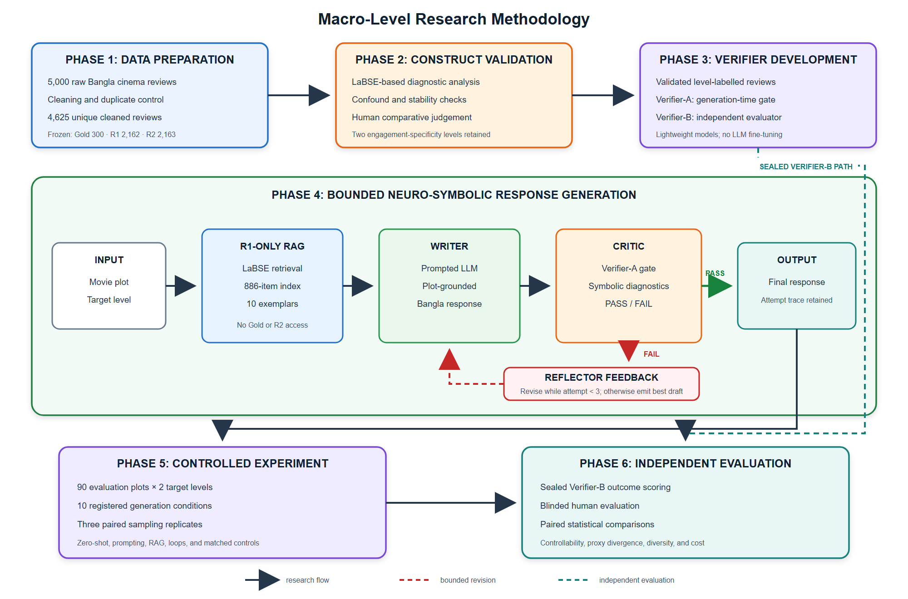
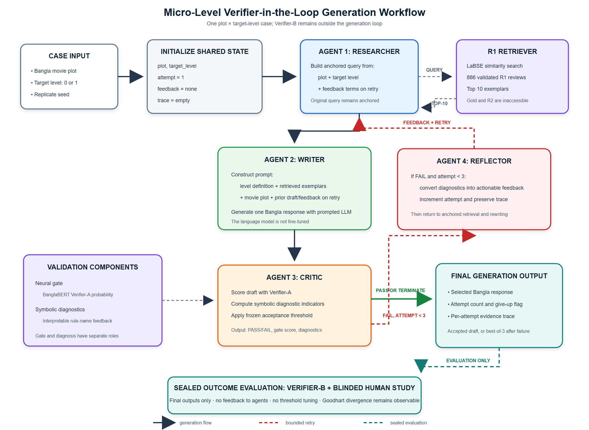
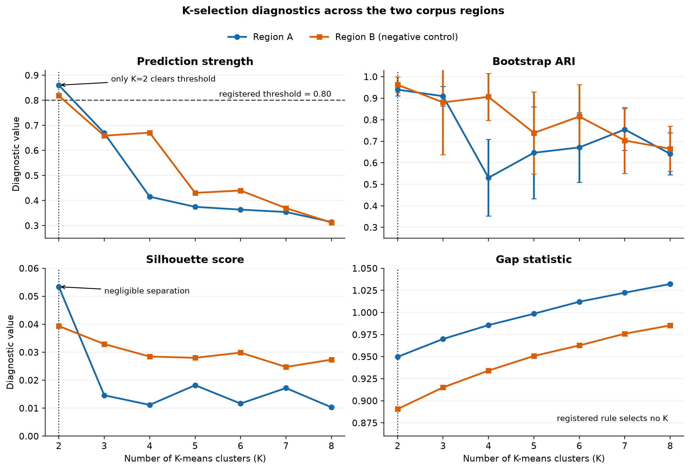

# Chapter 3 — Research Methodology

## 3.1 Chapter Overview

This chapter presents the research design and the methodological foundation of
the thesis. It describes the data resources, preprocessing rules, frozen data
partitions, construct-development procedure, human-validation instruments, and
reproducibility safeguards. Because the target response attribute was not
available as an existing label, construct development forms part of the
methodology rather than a preliminary convenience step. Geometric stability,
clusterability, sentiment, length, corpus provenance, and human judgment are
therefore evaluated jointly before the construct is used for generation.

Two data resources serve different purposes. The review corpus supports
construct development, retrieval, and verifier training. A separate corpus of
Bangla Wikipedia film synopses supplies generation stimuli. The resources are
not merged into film–review pairs because the review data contain no movie-title
field. Consequently, the study evaluates controlled response generation rather
than film-specific audience prediction.

Figure 3.1 summarizes the end-to-end research design and makes the principal
isolation constraints explicit. In particular, Gold-300 is evaluation-only,
retrieval is restricted to R1, and the sealed Verifier-B reaches generated
responses only during independent outcome evaluation.

*Figure 3.1. Macro-level research methodology. Solid arrows show the main
research flow, dashed red arrows show bounded revision, and the dashed teal
path denotes the isolation of Verifier-B from generation.*

## 3.2 Research Design

The study follows a staged quantitative design with two human-validation
components. First, the Bangla review corpus is audited and partitioned under
fixed data-access rules. Second, an engagement-related textual distinction is
developed through unsupervised representation analysis, confound diagnostics,
and a negative-control corpus region. Third, human judgments test whether the
retained distinction is perceptible and whether its direction corresponds to
engagement specificity. The validated levels then become the target variable
for the verifiers and controlled-generation experiment described in Chapters 4
and 5.

The design separates exploration, development, and evaluation. Exploratory
diagnostics may identify a candidate interpretation, but they cannot validate
it. Development decisions use only the permitted R1 development data and the 30
development plots. Gold-300, R2, and the 90 evaluation plots retain distinct
roles. The main generation experiment uses paired plot–level–seed cases so that
condition comparisons are made on identical inputs. Verifier-A may influence
generation; Verifier-B is reserved for outcome measurement and never enters the
loop.

The global random seed is 42. Additional generation seeds are treated as paired
sensitivity blocks rather than independent replications. No language model is
fine-tuned; only the registered lightweight verifier and calibration artifacts
are trained. This design supports claims about controllability and evaluation,
not prediction of real audience behaviour.

The chapter reports numerical evidence only where it operates as a
methodological gate: corpus provenance determines the admissible data region,
and human construct validation determines whether the candidate axis may be
used at all. Verifier training is specified and evaluated in Chapter 4, the
bounded generation system and its ten conditions are defined in Chapter 5, and
aggregate generation outcomes and paired statistical inference are reported in
Chapter 6. This separation prevents a construct-admission decision from being
confused with evidence that the generation framework succeeds.

Figure 3.2 details the execution of one plot–target-level case. The shared state
preserves the query anchor, feedback, attempt count, and complete trace across
revisions. Verifier-A controls the bounded generation loop, whereas Verifier-B
receives only the final output and cannot alter retrieval, rewriting, stopping,
or threshold selection.

*Figure 3.2. Micro-level verifier-in-the-loop generation workflow. Solid
arrows denote the generation path, dashed red arrows denote bounded retries,
and the dashed teal path denotes sealed outcome evaluation.*

## 3.3 Data Sources

### 3.3.1 Bangla Review Corpus

The primary resource is the *Raw Bangla Movie Review Comment Dataset for
Sentiment Analysis and Natural Language Processing*, version 3 [@b4]. The
workbook contains 5,000 rows with a review-text column and a three-class
sentiment label. It contains no audience demographics, movie identifier, source
URL, or row-level collection provenance. These absences rule out demographic
persona modelling and direct comparison between generated responses and real
responses to the same film.

The raw workbook was treated as read-only. Text processing was intentionally
minimal: whitespace was normalized, but Bangla characters were not
transliterated, stemmed, or subjected to stopword removal. This preserves the
short, informal register required by the contextual encoders and avoids
introducing preprocessing artefacts into the construct analysis.

### 3.3.2 Plot Corpus

Generation stimuli were collected separately from Bangla Wikipedia through the
MediaWiki API. The harvest identified 3,135 candidate articles; 124 passed the
mechanical quality gate, and 120 were retained after manual review. Each retained
row records its source URL, revision identifier, revision timestamp, and CC
BY-SA 4.0 metadata. Plot sections contain between three and twelve sentences,
with a median of nine. A seed-42 split assigns 30 plots to development and 90 to
the final evaluation surface. Plot text enters neither construct discovery nor
verifier training.

## 3.4 Data Preparation and Quality Control

The read-only audit reproduced eight of eleven quantities claimed in the initial
pipeline specification. It confirmed the 5,000-row size, sentiment counts,
204 exact duplicate occurrences, 72 reviews shorter than three whitespace
tokens, an eight-word median, an 84-word maximum, and the absence of URLs,
mentions, and emoji rows. It corrected three claims: there are two null rows,
206 normalized duplicate occurrences, and the rule-based usable count is 4,730
rather than approximately 4,722.

The discrepancy arose because the original estimate subtracted null, duplicate,
and short-review counts as though the sets were disjoint. Ten short reviews were
also duplicates. Cleaning therefore applied the rules sequentially and recorded
the actual change at each step. The raw audit counts 204 byte-identical duplicate
occurrences; after whitespace normalization, one additional pair becomes exact,
so the sequential cleaning stage removes 205 rows before the normalized-key
check removes one further row.

**Table 3.1. Audit and cleaning summary**

| Stage | Rows after stage | Rows removed | Decision |
|---|---:|---:|---|
| Raw workbook | 5,000 | — | Read-only source |
| Remove missing text or label | 4,998 | 2 | One missing text; one missing label |
| Strip URLs, HTML, and mentions | 4,998 | 0 | No matching rows |
| Normalize whitespace | 4,998 | 0 | 254 texts changed in whitespace only |
| Remove exact duplicates | 4,793 | 205 | First occurrence retained |
| Remove normalized duplicates | 4,792 | 1 | NFC/whitespace key used only for comparison |
| Remove reviews shorter than three words | 4,730 | 62 | Whitespace-token definition |
| Near-duplicate control | 4,625 | 105 | Applied before the frozen split |

Cleaning changed the sentiment distribution from 1,665/1,664/1,670 to
1,513/1,599/1,618 after rule-based cleaning. The decrease was therefore not
class-balanced, and no later step assumes equal class sizes. Stable review
identifiers were derived from raw row positions before filtering, allowing the
frozen map to refer to records without renumbering them. Near duplicates were
then controlled using cosine similarity of L2-normalized LaBSE embeddings [@b3]
at the registered threshold of 0.95; 105 additional rows were removed before
partitioning.

## 3.5 Data Partitioning and Isolation

Near-duplicate control produced a 4,625-row split surface. The partition was
stratified by sentiment and corpus region, rather than by a discovered cluster,
because the full-corpus clustering was subsequently shown to recover a source
signature. The split map is frozen and cannot be regenerated or reshuffled.

**Table 3.2. Frozen review-data partition**

| Partition | Rows | Region A / Region B | Permitted use |
|---|---:|---:|---|
| Gold-300 | 300 | 123 / 177 | Human construct evaluation only |
| R1 | 2,162 | 886 / 1,276 | Region-A subset supplies the 886-item RAG index and Verifier-A pool |
| R2 | 2,163 | 888 / 1,275 | Region-A subset supplies the 888-item Verifier-B pool |
| R1 development subset | 200 | 82 / 118 | Threshold and model-development decisions within R1 |

The development subset is contained within R1; it is not a fourth disjoint
partition. Gold-300 is evaluation-only. Retrieval uses R1 exclusively, and
more specifically its 886-row Region-A subset; the 1,276 Region-B rows do not
enter the core retrieval or verifier path. Verifier-B is developed from the
888-row Region-A subset of R2 and remains unavailable to generation. These
restrictions are methodological isolation walls, not merely bookkeeping
conventions.

## 3.6 Corpus Provenance Assessment

Initial clustering over the full cleaned corpus appeared to recover three
groups. A trap-check against sentiment produced an adjusted Rand index (ARI) of
0.1793, suggesting that the partition was not simply the sentiment label.
However, inspection of row order and register revealed a sharper explanation:
the workbook contains two contiguous corpus regions joined at raw row 1,999.

Region A contains the first 1,999 raw rows and has the varied punctuation and
first-person language expected of organically collected comments. Region B
contains the remaining 3,001 rows and has a highly uniform sentence-final and
lexical signature. All neutral-labelled reviews occur in Region B. The region
variable predicts the full-corpus clustering with 93.3% accuracy; its binary ARI
is 0.7487 and φ is 0.861. The apparent audience grouping is therefore primarily
a corpus-source detector.

**Table 3.3. Source-region signature in the raw workbook**

| Diagnostic | Region A | Region B |
|---|---:|---:|
| Rows | 1,999 | 3,001 |
| Danda-terminated reviews | 38.7% | 99.2% |
| First-person language | 13.5% | 0.8% |
| Exclamation marks | 3.4% | 0.3% |
| Median words | 9 | 8 |
| Word types per 1,000 tokens | 255.0 | 127.6 |
| Neutral-labelled reviews | 0 | 1,670 |

Because original row-level source metadata were not retained, the precise
origin of Region B cannot be reconstructed. The observable source signature is
nevertheless sufficient to prevent the full-corpus partition from being
interpreted as audience structure. Construct development was therefore limited
to Region A, while Region B was retained as a negative control.

## 3.7 Construct Development and Diagnostic Validation

Reviews were represented with Language-Agnostic BERT Sentence Embedding (LaBSE)
[@b3]. K-means solutions from K=2 to K=8 were compared using prediction strength
[@b38], bootstrap ARI [@b39], silhouette [@b43], the gap statistic [@b40], and
cluster-size balance. HDBSCAN provided a density-based check that did not require
a fixed K [@b41; @b42]. All clustering was performed in the original embedding
space rather than a visualization projection.

The diagnostics answer different questions and were not combined into a single
post-hoc score. Prediction strength and bootstrap ARI assess reproducibility;
silhouette and the gap statistic assess separation; HDBSCAN tests whether a
density-supported grouping exists; ARI with sentiment tests label rediscovery;
and directionless AUC measures whether length or another surface feature can
recover the partition. Region B provides a negative control for the possibility
that a stable partition can be contentless.

**Table 3.4. Construct-analysis components and decision roles**

| Component | Purpose | Interpretive role |
|---|---|---|
| K-means, K=2–8 | Generate candidate partitions | Candidate construction only |
| Prediction strength | Test out-of-sample reproducibility | Primary K-selection criterion |
| Bootstrap ARI | Measure assignment stability | Stability evidence |
| Silhouette and gap statistic | Assess geometric separation | Clusterability evidence |
| HDBSCAN | Test density-supported grouping without fixed K | Independent structural diagnostic |
| ARI with sentiment | Detect sentiment rediscovery | Mandatory construct trap-check |
| Surface-feature AUC | Test length and stylistic confounds | Bounds construct interpretation |
| Region-B negative control | Test whether stability carries content | Negative control |
| Human judgments | Test perceptibility and direction | Construct-validity arbiter |

Figure 3.3 displays the four K-dependent diagnostics without collapsing them
into a single score. Prediction strength is the registered selection criterion:
K=2 is the only candidate above 0.80 in both regions. Bootstrap ARI shows that
this cut is reproducible, whereas the very small silhouette values and the
absence of a gap-statistic selection show that reproducibility is not evidence
of well-separated natural groups. HDBSCAN is not plotted as a function of K
because it does not require a prespecified cluster count; its independent
density-based result is reported in Table 3.5.

*Figure 3.3. K-selection diagnostics for K=2–8. Points show the frozen
diagnostic values; whiskers show ±1 bootstrap standard deviation for ARI and
±1 standard error for the gap statistic. The vertical dotted line marks K=2,
and the dashed horizontal line marks the registered prediction-strength
threshold of 0.80. Region B is a negative control. The figure supports K=2 as a
stable operational bisection, not as evidence of two discrete audience
personas.*

For Region A, K=2 was the only solution to clear the registered prediction-
strength threshold of 0.80, reaching 0.8605 with bootstrap ARI 0.9399 ± 0.0290.
The cut was not identical to sentiment (ARI=0.1522). These stability results did
not establish discrete structure: silhouette was only 0.0534, the gap statistic
selected no K, and HDBSCAN labelled all points as noise. The correct geometric
interpretation is therefore a reproducible bisection of a continuum rather than
two naturally separated groups.

Profiling showed that length was an important but incomplete component of the
cut. Word count recovered the assigned level with AUC 0.6764. The longer half
averaged 13.12 words and the shorter half 8.85 words; at an equal 4,000-token
budget, however, the shorter half contained approximately 1,913 word types
against 1,623 in the longer half. A residual classifier improved by 9.81
percentage points over sentiment and length together, but this estimate is a
resubstitution upper bound and lies close to its registered threshold. It is
reported as weak descriptive evidence, not confirmatory inference.

Region B demonstrates why stability alone is insufficient. Its K=2 cut has
prediction strength 0.8183 and bootstrap ARI 0.9624, yet silhouette is 0.0394,
HDBSCAN labels 96.7% of observations as noise, and the Region-A length and
lexical-richness signatures do not replicate.

**Table 3.5. Construct evidence and Region-B negative control**

| Diagnostic | Region A | Region B | Interpretation |
|---|---:|---:|---|
| Split-surface rows | 1,897 | 2,728 | Separate corpus regions |
| Selected K | 2 | 2 | Both can be bisected |
| Prediction strength | 0.8605 | 0.8183 | Stable in both regions |
| Bootstrap ARI | 0.9399 ± 0.0290 | 0.9624 ± 0.0362 | Stability does not imply content validity |
| Silhouette | 0.0534 | 0.0394 | Negligible separation |
| Gap statistic | No K selected | No K selected | No positive clusterability evidence |
| HDBSCAN noise | 100% | 96.7% | No density-supported groups |
| ARI with sentiment | 0.1522 | 0.0107 | Neither is a sentiment relabelling |
| Length AUC | 0.6764 | 0.5498 | Region-A cut is length-confounded |
| Richness inversion across length quartiles | 4/4 | 1/4 | Content signature does not replicate in Region B |

These results reject the interpretation of the two halves as audience personas.
They leave open a narrower question: whether people can perceive a consistent
textual distinction across the Region-A cut.

## 3.8 Human Validation Attempt 1: Ordinal Ratings

Two human-validation instruments were used, and their outcomes are kept
separate. The first asked two native-Bangla annotators to assign a score from 0
to 3 to Gold-300 reviews. Of 600 possible ratings, 598 were returned and 298
items were rated by both annotators. Ordinal Krippendorff's alpha [@b31] was
0.4970, below the registered reliability floor of 0.667. Although exact
agreement was 75.5%, both raters concentrated their judgments on category 2,
making the scale insufficiently discriminative. Gwet's AC1 was 0.8705, but it
was not used to override the registered alpha gate because AC1 can respond
differently under prevalence imbalance [@b44; @b45]. The result of the first
instrument is inconclusive, not evidence that the construct is absent.

## 3.9 Human Validation Attempt 2: Comparative Judgments

The second instrument used comparative judgments, which can be more reliable
than absolute rating scales for subjective intensity [@b29]. Each of 50 sets
contained three reviews from one side of the Region-A cut and one from the
other. These items were drawn from Region A while excluding Gold-300, so neither
the failed instrument nor its evaluation material was reused. Reviews within a
set were matched to a maximum two-word span. Accuracy was evaluated separately
for each annotator using exact one-sided binomial tests and Wilson confidence
intervals. A length-only heuristic was evaluated on the same sets. A separate
direction task asked which member of a cross-level pair referred to something
particular in the film.

The length-only heuristic achieved 0.16 against a chance rate of 0.25. The
annotators, without being told the name of the construct, identified 39/50 and
42/50 intruders; both answered 34/40 direction items correctly. These outcomes
are included here because they determine whether the candidate construct may be
operationalized in the subsequent methodology.

**Table 3.6. Human validation design and evidence**

| Instrument | Sample | Result | Interpretation |
|---|---|---|---|
| Ordinal rating | 598 ratings; 298 doubly rated items | Ordinal α=0.4970; exact agreement=75.5% | Reliability gate failed; inconclusive |
| Intrusion detection, Annotator A | 50 length-matched sets | 39/50=0.780; 95% CI [0.648, 0.872]; *p*=5.7×10⁻¹⁵ | Above 0.25 chance |
| Intrusion detection, Annotator B | 50 length-matched sets | 42/50=0.840; 95% CI [0.715, 0.917]; *p*=3.0×10⁻¹⁸ | Above 0.25 chance |
| Direction judgment, each annotator | 40 cross-level pairs | 34/40=0.850; 95% CI [0.709, 0.929]; *p*=4.2×10⁻⁶ | Direction identified as engagement specificity |

The two annotators agreed on 70% of intrusion sets and 75% of direction pairs.
The study does not treat the pooled 81/100 intrusion responses as 100
independent trials because both annotators judged the same sets. The
per-annotator results are the relevant evidence. The panel is small and based on
a convenience sample; detailed ethical and external-validity implications are
reported in Chapter 7.

## 3.10 Operationalization of the Construct

The validated construct is an engagement-specificity continuum represented by
two operational levels. It is not a demographic persona, natural cluster, or
audience segment.

**Table 3.7. Operational engagement-specificity levels**

| Level | Definition | Diagnostic question |
|---|---|---|
| Level 0 | A general or formulaic opinion that may name a broad film element but does not connect the opinion to a particular reason, event, relationship, or narrative detail | Could the response be placed under many different films without changing its meaning? |
| Level 1 | A response that connects an opinion to a particular event, character, relationship, comparison, expectation, or narrative element | Would the response cease to fit if it were moved to a different film? |

Sentiment does not define the levels: praise and criticism may occur at either
level. Length also does not define them, even though the corpus cut is
length-confounded. The operational distinction is comparative and
prototypical, reflecting what the human instrument validated. Later chapters
therefore use the terms *axis*, *level*, and *cut*, while the variable name
`cluster_k2` is retained only where required by frozen computational artifacts.

## 3.11 Ethics, Reproducibility, and Methodological Limitations

Human annotation involved adult native-Bangla volunteers who participated with
informed consent. Responses were stored under coded identifiers, and personal
identity and consent records remain outside the public research artifacts. The
annotators were university peers known to the researcher, creating a possible
social-pressure and convenience-sampling bias. No claim of institutional ethics
approval or exemption is made. The two-annotator design also departs from the
originally planned three-annotator construct study and is retained as a declared
limitation rather than represented as equivalent.

Reproducibility is enforced through a read-only raw-data boundary, stable row
identifiers, global seed 42, a non-overwritable split map, configuration-driven
scripts, and artifact provenance. The Wikipedia plot corpus additionally stores
the exact article revisions and licence metadata. Gold-300, R1, R2, and the plot
splits retain fixed privileges throughout the subsequent chapters.

The chapter establishes that the Region-A cut is stable and human-recognizable,
but several limitations bound that result:

- the source workbook lacks row-level provenance and movie identifiers;
- Region B has a strong non-organic register signature and is excluded from
  construct development;
- Region A shows negligible cluster separation and 100% HDBSCAN noise;
- the retained cut remains associated with sentiment and length;
- the successful human instrument used only two annotators from a convenience
  sample; and
- human recognizability of a textual distinction does not establish real-world
  audience segments or film-specific response validity.

In generated text, requested level also remains recoverable from length alone
at AUC 0.91–0.99. Consequently, subsequent chapters may claim control of a
human-recognizable response style, but not length-neutral control, audience
simulation, or prediction of authentic audience reception.

## 3.12 Chapter Summary

The audit reduced 5,000 raw reviews to a frozen 4,625-row analysis surface and
identified a major corpus-source confound. Full-corpus clustering recovered that
source signature rather than audience structure. Within the admissible
Region-A subset, K-means produced a stable K=2 cut, but silhouette, gap, and
HDBSCAN diagnostics rejected an interpretation as discrete natural groups. A
length-matched comparative study nevertheless showed that two native-Bangla
annotators could detect the distinction and identify its direction. RQ1
therefore receives qualified support for a two-level engagement-specificity
axis, not for audience personas. Chapter 4 develops the disjoint in-loop and
outcome verifiers used to operationalize this axis.
