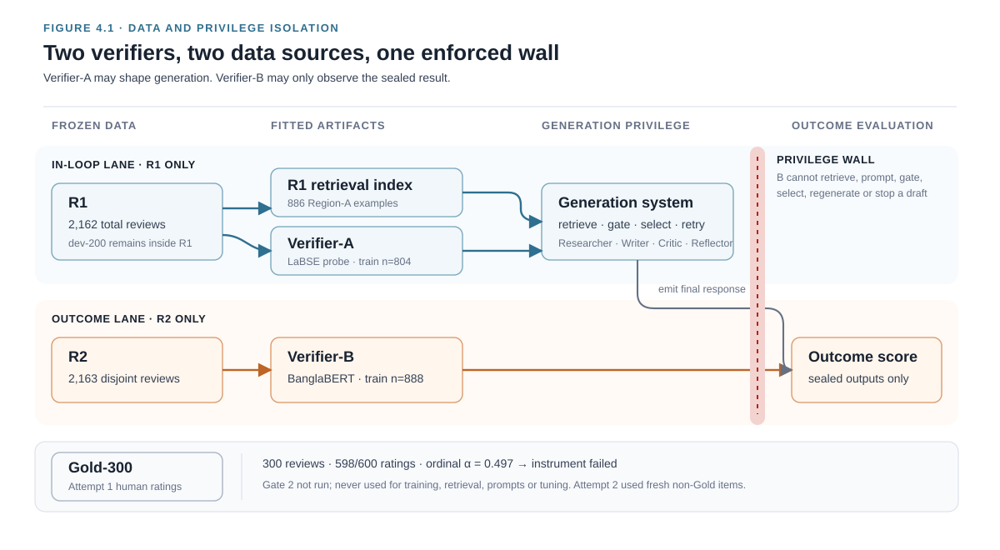

# Chapter 4 — Verifier Development, Validation, and Isolation

## 4.1 Chapter Overview

Chapter 3 established a reproducible two-level operationalisation of the
engagement-specificity continuum in region A and showed that human annotators
could recover the distinction under length-matched comparative judgement. The
generation experiments additionally require an automatic instrument that can
score whether a response is consistent with a requested level. This chapter
develops two such instruments with deliberately different data access and
system privileges: an in-loop verifier for generation control and an
outcome-only verifier for evaluation.

## 4.2 Dual-Verifier Architecture

Verifier-A is the in-loop gate. It scores each draft the generator produces, it
determines acceptance against the frozen threshold introduced in Chapter 5, and
it selects among the candidates in the blind-resampling condition. Verifier-B is
an outcome-only evaluator. It never enters retrieval, prompting, feedback,
candidate selection, or regeneration; it is applied once, after all generation
has finished, to score what the system produced. The two classifiers are trained
on disjoint halves of the corpus and belong to different pretraining families,
and both are evaluated on the same 82-row development slice.

The reason for building two rather than one is a measurement problem rather than
a performance problem. Generation requires a scorer that can be called thousands
of times on ordinary hardware; evaluation requires a scorer that has not
participated in any of those calls. If a single model performed both roles, a
high final score would be uninterpretable, because a system that improved and a
system that learned the idiosyncratic boundary of its own judge would produce
the same number. Recent work on reward hacking evaluates optimised policies
with a cross-family reference panel kept outside optimisation, allowing
divergence between an optimised proxy and independent reference models to be
detected [@b69]. The dual-verifier
design does not make either classifier ground truth. It creates a controlled
disagreement that can be inspected after generation has finished, and Chapter 6
inspects it.

This chapter establishes the measurement instruments required by the subsequent
experiments. RQ2 uses Verifier-B probability as an outcome measure, RQ3 compares
conditions that differ in their use of Verifier-A, and RQ4 examines divergence
between the two verifiers on the same generated responses. Section 4.5 also
identifies a construction-circularity finding that constrains the interpretation
of the operational levels introduced in Chapter 3.

Finally, and throughout, the two classifiers reproduce the operational two-level
label defined in Section 3.10. Their scores are not independent estimates of
human validity. Human validity comes from the comparative intrusion study of
Section 3.9 and from the blinded evaluation of generated output in Chapter 6,
neither of which uses either verifier.

*Figure 4.1. Data and privilege isolation for the two verifiers. Gold-300
remains evaluation-only and does not enter model fitting, retrieval, prompting,
or threshold selection. R1 supplies retrieval and the in-loop
Verifier-A; disjoint R2 supplies the outcome-only Verifier-B. The dashed wall
marks the privilege Verifier-B does not have: it cannot influence generation,
candidate selection, or retry.*

## 4.3 Training and Evaluation Protocol

All verifier development uses the labelled region-A rows of the frozen split.
Verifier-A and every arm of the backbone ablation train on the 804 R1 rows that
carry a two-level label, distributed 481 at Level 0 and 323 at Level 1.
Verifier-B trains on the 888 disjoint R2 rows, distributed 531 and 357. Both are
evaluated on the same 82-row development slice, 53 rows at Level 0 and 29 at
Level 1. Gold-300 is not read by any step in this chapter, and the ablation does
not read R2 because R2 is reserved for Verifier-B. Configuration-level
assertions verify the expected row counts before training, thereby preserving
consistency with the registered split and sample sizes.

The seven candidate recipes, their training budget, and the reason each was
registered as a candidate are given in Table 4.1. The budget is identical across
the five conventional fine-tuning arms. BERT-NLI transfer and SetFit follow
specialised procedures and are therefore not compute-matched to those arms.
All runs used the same single-GPU environment, but wall-clock time was not
constrained across paradigms. The maximum sequence length of 128 tokens is
generous rather than binding, since Chapter 3
established a median review length of eight words.

**Table 4.1. Registered backbone candidates and their methodological roles**

| Candidate | Pretraining scope | Adaptation strategy | Methodological role in the ablation |
|---|---|---|---|
| BanglaBERT | Bangla-specific | End-to-end fine-tuning | Registered monolingual reference and pipeline default |
| XLM-R | Multilingual | End-to-end fine-tuning | Multilingual reference for assessing the value of language-specific pretraining |
| MuRIL | Indic multilingual | End-to-end fine-tuning | Indic-specialised comparator motivated by Bangla emotion-classification evidence [@b26] |
| mBERT | Multilingual | End-to-end fine-tuning | Established multilingual transformer baseline |
| IndicBERTv2 | Indic multilingual | End-to-end fine-tuning | Indic-language comparator motivated by Bangla register-classification evidence [@b28] |
| SetFit–LaBSE | Multilingual sentence encoder | Contrastive few-shot adaptation | Low-resource discriminative alternative using the pipeline's sentence encoder [@b61] |
| BERT-NLI | Multilingual NLI | Entailment-based transfer | Transfer-learning comparator for limited and imbalanced training data [@b51] |

Shared budget for arms 1–5: learning rate in {2 × 10⁻⁵, 3 × 10⁻⁵}, four epochs,
batch size 16, maximum sequence length 128, seeds 42 through 46. Arm 6 uses 20
pair-sampling iterations, the published default. Arms 6 and 7 follow their own
procedures; their compute budgets are not directly comparable with arms 1–5.

Macro-F1 is the principal metric because the two levels are imbalanced at
roughly 65 to 35 in both the training and development slices, and accuracy on
such a split rewards a classifier for ignoring the minority level. Arms are run
over five seeds rather than three, and the variation across those seeds is
reported as a sensitivity measurement and never as a decision rule. This
distinction is not stylistic. There is direct evidence that small absolute
effect sizes combined with few repetitions readily produce wrong conclusions in
model comparison [@b46], that only a minority of transformer papers report
multiple runs at all and that robustness to seed and hyperparameter choice is
low [@b47], and there is a theoretical stability bound behind the phenomenon
[@b48]. Treating a mean over five seeds as though it settled a comparison would
be an instance of precisely the practice these papers document.

The registered decision rule is therefore a paired bootstrap significance test
over the development predictions, with 10,000 resamples, α = 0.05, and
Benjamini–Hochberg correction across all 21 pairwise comparisons [@b49; @b50].
The rule was fixed, together with the arm set and the tie-break, before any
backbone had been downloaded. Four outcomes were pre-committed: one arm
significantly best, in which case it becomes the verifier and the choice is
empirically justified; a set of arms statistically indistinguishable, in which
case the tie is reported as the result and broken on openly declared
non-performance grounds; BanglaBERT significantly beaten, in which case the
winner is used and the monolingual-versus-multilingual comparison becomes a
small finding in its own right; and every arm near chance, in which case the
two-level label is not learnable at this sample size from text of this length
and RQ2 cannot proceed as specified. No arm could be added after seeing a
result, none could be dropped for performing badly, and no hyperparameter search
beyond the two learning rates was permitted.

One property of the development slice must be disclosed before any number from
it is read. Dev-82 carries three roles: it is the surface on which each arm's
learning rate was selected, the surface on which both temperature scalings were
fitted, and the surface on which all results in this chapter are reported. The
consequence is that the arm means below are descriptive development-set
estimates rather than unbiased held-out performance estimates. Macro-F1 is
class-dependent, so its differences cannot be converted into a constant number
of items. The pre-registration states this in advance of
the numbers, which is the only order in which such a limitation can be recorded
without appearing to be an excuse.

## 4.4 Backbone Ablation Results

The ablation tests a question that the Bangla classification literature does not
settle consistently. Recent studies report different leading models on related
tasks. MuRIL is reported as outperforming both BanglaBERT and XLM-R on Bangla
emotion detection [@b26]. XLM-R is reported above BanglaBERT, 94.0 against 93.4
per cent, on formal-versus-colloquial style classification over the BanglaBlend
dataset [@b27]. IndicBERTv2 is reported at 95.44 per cent above both XLM-R and
BanglaBERT on the *same* BanglaBlend data [@b28]. The two studies of BanglaBlend
therefore identify different leading models on the same dataset. Language-
specific pretraining alone consequently does not justify selecting BanglaBERT,
motivating the registered empirical comparison.

**Table 4.2. Descriptive backbone-ablation performance on dev-82**

| Candidate | Mean macro-F1 | Seed SD | Selected learning rate | Inferential interpretation |
|---|---:|---:|---:|---|
| BanglaBERT | 0.9647 | 0.0209 | 3 × 10⁻⁵ | Selected by the registered non-performance tie-break |
| SetFit–LaBSE | 0.9590 | Not estimable | Not applicable | Included in the tied set |
| IndicBERTv2 | 0.9560 | 0.0156 | 3 × 10⁻⁵ | Included in the tied set |
| MuRIL | 0.9421 | 0.0391 | 3 × 10⁻⁵ | Included in the tied set |
| mBERT | 0.9402 | 0.0125 | 2 × 10⁻⁵ | Included in the tied set |
| XLM-R | 0.9360 | 0.0219 | 3 × 10⁻⁵ | Included in the tied set |
| BERT-NLI | 0.9298 | 0.0165 | 3 × 10⁻⁵ | Included in the tied set |

*Note.* The SetFit implementation produced one distinct effective
configuration; therefore, neither seed variability nor learning-rate selection
is reported. For the remaining candidates, SD is calculated across five seeds
at the selected learning rate.

The SD is computed over the five seeds at the selected learning rate, not over
all ten runs per arm. Because that learning rate was selected by best mean on
this same development slice, the levels are not clean held-out estimates.

None of the 21 pairwise comparisons is significant after Benjamini–Hochberg
correction. The smallest unadjusted *p*-value in the entire family is 0.0960,
for BanglaBERT against XLM-R and for BanglaBERT against BERT-NLI; BanglaBERT
against mBERT follows at 0.0966. A robustness check that pooled across both
learning rates instead of selecting one returned the same verdict. The
registered outcome is therefore `TIE`.

BanglaBERT was selected using the registered non-performance tie-break: smallest
parameter count first and the pipeline default second. The selection therefore
does not constitute evidence that BanglaBERT is empirically superior to the
other six candidates for this task.

Two consequences follow. First, the experiment does not provide evidence that
fine-tuning offers a material advantage over a cheaper classifier for this
operational label. Section 4.5 examines the circularity that explains this
result, and Section 4.6 specifies the resulting verifier designs. Second, the
observed seven-arm range of 0.0349 macro-F1 is descriptive only: no corrected
pairwise comparison supports a backbone ranking.

One arm requires a separate warning. In the SetFit implementation, the nominal
learning-rate and seed settings were not passed to the effective estimator.
The ten nominal runs therefore produced one distinct prediction vector. Its
mean is retained in Table 4.2 for completeness, but the zero standard deviation
is not interpreted as stability and the reported learning-rate selection is
withdrawn. BERT-NLI is
retained on its own registered grounds, that transfer-based classification can
reduce annotation requirements in small-data settings [@b51]; and the broader
finding that fine-tuned smaller models still outperform zero-shot generative
classifiers on text classification [@b52] is the reason trained discriminative
baselines were evaluated at all rather than assuming a prompted large language
model would serve as the verifier.

## 4.5 Circularity Analysis

### 4.5.1 Circularity Baselines

The ablation was accompanied by a set of reference points registered before the
frozen-probe number existed. Those reference points changed the interpretation
of the entire seven-arm experiment, and they are the most consequential result
in this chapter.

**Table 4.3. Reference models used to assess construction circularity on dev-82**

| Reference model | Macro-F1 | Classification errors | Analytical purpose |
|---|---:|---:|---|
| Majority-class classifier | 0.3926 | 29 | Establishes the lower reference under minority-class neglect |
| Training-fitted length rule | 0.6197 | — | Quantifies performance obtainable from review length alone |
| Frozen LaBSE encoder with an L2-logistic head | **0.9866** | 1 | Measures linear recovery from the representation used to construct the labels |
| BanglaBERT, five-seed mean | 0.9647 | — | Provides the highest descriptive mean among the fine-tuned candidates |

*Figure 4.2. Descriptive mean macro-F1 for the seven registered candidates on
dev-82 and the frozen LaBSE–logistic reference. Horizontal whiskers show ±1
seed standard deviation and are not confidence intervals. SetFit–LaBSE has no
whisker because its nominal runs produced one distinct effective configuration.
No pairwise candidate comparison was significant after Benjamini–Hochberg
correction.*

The frozen probe is not a better model. It is the same geometry the label came
from. Section 3.6 established that the two-level partition was produced by
K-means on LaBSE sentence embeddings, so a linear classifier trained on those
same embeddings is the label's own generating geometry being asked to reproduce
itself, and it does so to within one development item of the best of seven
fine-tuned transformers. The registered verdict is `CIRCULARITY_CONFIRMED`.

Three consequences were fixed in the pre-registration and are honoured here. The
seven-arm table may support no claim about backbone quality; it is reported as a
demonstration that the label is linearly recoverable from the representation
that produced it. The `TIE` verdict stands but is re-explained: the arms are
indistinguishable because the task is near-saturated by construction, not
because these seven backbones are interchangeable in general or on any other
task. And Verifier-A is reconsidered from first principles, since a logistic
regression on frozen embeddings that matches a fine-tuned transformer makes the
fine-tuning's cost inside a generation loop indefensible.

The length rule deserves a second look, because it is the one reference point
that carries information beyond the circularity finding. A rule that consults
nothing but word count reaches 0.6197 against a majority floor of 0.3926, which
is consistent with the `LENGTH_CONFOUNDED` verdict recorded for the same cut in
Section 3.6. Length is a substantial component of the axis, and Chapter 3's
residual analysis is what establishes that it is not the whole of it. No verifier
in this chapter is credited with having separated the two.

### 4.5.2 Methodological Implications

The circularity finding affects the interpretation of both the operational
levels and the subsequent generation experiments. Four implications follow.

The first consequence bounds what any verifier score in this thesis can mean. A
Verifier-A or Verifier-B probability is an estimate of whether a piece of text
falls on the Level 1 side of a boundary that K-means drew in LaBSE space. It is
not a measure of audience response, not a detection of a persona, and not a
prediction of how viewers will react to a film. Every number in Chapter 6
inherits this limit, and the language of Chapter 6 is chosen to respect it.

The second consequence motivates Verifier-A's design. On this development
slice, fine-tuning did not improve upon the frozen probe; a frozen encoder with a
linear head requires no gradient computation, no GPU inside the generation loop,
and seconds rather than minutes to fit. The cheap option was chosen because the
expensive one demonstrably purchased nothing, which is a different and stronger
argument than choosing it because it was cheap.

The third consequence is the one that turns a weakness into the thesis's central
experiment. If the in-loop gate is a linear function of a fixed embedding space,
then a generator optimised against that gate has an obvious and *cheap* route to
higher scores that does not involve writing better text: move the draft toward
whatever region of LaBSE space the boundary favours. Under this construction,
proxy divergence is the expected failure mode rather than a remote theoretical
worry, which is why Verifier-B is a different pretraining family trained on
different rows, and why the Goodhart diagnostic in Chapter 6 is a necessary
component of the design rather than a prudent extra. The circularity finding is
the reason for the registered prohibition against using Verifier-B inside the
generation loop.

The fourth consequence bounds Chapter 3 rather than Chapter 6. The stability
evidence reported there — prediction strength 0.8605 and bootstrap ARI 0.9399 ±
0.0290 at K = 2 — describes how reproducibly an algorithm redraws the same cut,
and Section 4.5 shows that the same cut is almost perfectly recoverable by a
linear probe on its originating embeddings. Both are statements about geometry.
Neither is evidence that the cut corresponds to natural categories, and the
thesis does not use them that way.

What the circularity finding does *not* imply is that the label is empty. That
question is settled elsewhere and settled independently: the comparative
intrusion study of Section 3.9 had human annotators recover the distinction at
0.780 and 0.840 against a chance rate of 0.25, on length-matched items, using no
verifier and no embedding. The axis is linear in LaBSE space and also
perceptible to people. The first fact constrains what the verifiers measure; the
second is why measuring it is worth doing.

## 4.6 Final Verifier Configurations

### 4.6.1 Verifier-A: In-Loop Gate

Verifier-A is a frozen `sentence-transformers/LaBSE` encoder [@b3] with an
L2-regularised logistic head, trained on the 804 R1 rows. Nothing is fine-tuned,
consistent with the registered scope of two logistic-regression artifacts. The
head's hyperparameters are library defaults fixed in
the configuration file — inverse regularisation strength 1.0, L2 penalty, a
2,000-iteration limit, and L2-normalised embeddings — and none of them was
selected by looking at a development score. The encoder string is required by
configuration to match the one used to produce the partition, because if it did
not, this verifier would not be the artifact whose circularity Section 4.5
measured and that verdict would not transfer to it.

On dev-82 the artifact reaches macro-F1 0.9866, which is one error on 82 items.
That figure reproduces the frozen-probe reference point of Table 4.3 exactly,
for the same model on the same rows, and reproducing it is the purpose of
running the check rather than an incidental coincidence.

The single error is the classifier's least confident prediction. Before
temperature scaling, five development items fall in the 0.4-to-0.6 confidence
band and their empirical accuracy is 0.8, while every item above 0.6 confidence
is classified correctly. The one mistake Verifier-A makes on this slice is
therefore a case it was already unsure about, which is the benign form of an
error for a gate that will later be applied with a threshold.

The value of 0.9866 measures label reproduction rather than human validity. The
literature that motivated the choice of a logistic head over a more expressive
one supports the artifact on exactly these grounds: logistic regression remains
appropriate for extremely low shot counts, high-dimensional representations, and
near-ceiling tasks [@b83], and this task is high-dimensional at 768 LaBSE
dimensions and near-ceiling at one error in 82.

The strength is also the risk, and the risk is specific rather than
philosophical. A verifier that is a linear function of LaBSE may be gameable by
a generator whose output is scored in that same space, without that generator
producing better writing in any sense a reader would recognise. That is the
failure RQ4 exists to detect, Verifier-B is the instrument that detects it, and
Section 4.8 defines the wall that preserves this separation.

### 4.6.2 Verifier-B: Outcome-Only Evaluator

Verifier-B uses the BanglaBERT *recipe* — the backbone [@b2], four-epoch budget,
and seeds used in the ablation — but is retrained from scratch on the 888 R2
rows at the single registered learning rate of 2 × 10⁻⁵.
The distinction between the recipe and the checkpoint is methodologically
important. Every
checkpoint produced by the ablation was trained with role A, that is, on R1,
which is Verifier-A's data. Loading one of them as Verifier-B would have placed
both verifiers on the same rows and invalidated the isolation required for RQ4,
since "the loop improved the text" and "the loop learned the shared
training distribution" would have become indistinguishable. The configuration
therefore declares its role explicitly and a test fails if that declaration ever
changes.

Verifier-B trains at a single learning rate of 2 × 10⁻⁵, the value the pipeline
specification names as the default, and it is never selected against a score.
The reason is a specific and recent finding about hyperparameter selection:
re-analysis of seven large HPO benchmark suites shows that selecting the
validation-optimal configuration generalises *worse* than the default in roughly
ten per cent of runs, and the conditions that aggravate this are small datasets,
holdout rather than cross-validation, binary classification, and accuracy-type
metrics [@b82]. These risk factors are relevant here: 888 training rows, an
82-row holdout, two classes, and macro-F1. Although repeated cross-validation is
the recommended remedy, this study instead fixed the learning rate without
validation-based selection. This reduces selection bias but may sacrifice
performance relative to a tuned configuration; the trade-off preserves the
intended independence of Verifier-B's evaluation role.

The persisted artifact is the seed-42 model, declared in the configuration before
any score existed, and explicitly not the best of five. An ensemble of all five
seeds was considered and rejected, because Verifier-A is a single model and an
ensembled B would make the RQ4 gap partly a gap between one model and five,
which no later analysis could separate out. Symmetry with A was judged worth more
than the ensemble's calibration benefit.

That artifact reaches dev macro-F1 0.9597, three errors on 82 items. Across the
five seeds the same recipe yields 0.9674 ± 0.0158, with individual runs spanning
0.9448 to 0.9866 — that is, one error to four errors on the same 82 rows. This
band is reported as sensitivity, never as a score distribution for model
comparison, and it is also the clearest available caution against reading any
small difference on this slice as a difference between models: an identical
recipe moves by three items across seeds.

The distribution of Verifier-B's errors differs from Verifier-A's in a way that
matters for the next section. Of its three errors, one is a low-confidence case
and two are made among the 81 items it scores above 0.8 confidence, where its
empirical accuracy is 0.9753 against a mean confidence of 0.9840. Verifier-A's
single error was its least confident prediction; Verifier-B's errors are mostly
confident ones. Its registered verdict is `COMPETENT_EVALUATOR`, and the
pre-committed reading of two verifiers both above roughly 0.90 macro-F1 is that
the cross-family wall is built from two competent evaluators — with no claim that
either is better than the other.

The ablation's BanglaBERT arm scored 0.9647, and that figure appears nowhere in
this thesis as a before-and-after pair with 0.9597. It is a different model
trained on different rows and is quoted only as context.

**Table 4.4. Functional and methodological comparison of the two verifiers**

| Dimension | Verifier-A | Verifier-B |
|---|---|---|
| System function | In-loop scoring, acceptance, and candidate selection | Outcome-only evaluation after generation |
| Training partition | R1, *n* = 804 (Level 0/1: 481/323) | R2, *n* = 888 (Level 0/1: 531/357) |
| Encoder family | LaBSE multilingual sentence encoder | BanglaBERT Bangla-specific ELECTRA |
| Model adaptation | Frozen encoder with an L2-regularised logistic head | End-to-end fine-tuning |
| Hyperparameter selection | Fixed library defaults; no development-score selection | Registered learning rate; no development-score selection |
| Evaluation data | dev-82 (Level 0/1: 53/29) | dev-82 (Level 0/1: 53/29) |
| Development macro-F1 | 0.9866 (1 error) | 0.9597 (3 errors; persisted seed-42 model) |
| Seed sensitivity | Deterministic fit; not applicable | Mean 0.9674 ± 0.0158; range 0.9448–0.9866 |
| Calibration interpretation | Improvement supported on dev-82 (Section 4.7) | Improvement not established on dev-82 |

## 4.7 Probability Calibration

Calibration was registered as descriptive, and it was registered that way before
either verifier existed. The pipeline had described calibration as a hidden
contribution, with a ten-bin reliability diagram and before-and-after expected
calibration error. At 82 development rows a ten-bin diagram places roughly eight
items in a bin, making the resulting estimate sensitive to binning noise. The
implemented analysis therefore uses five bins, with the bin count fixed before
the results were inspected. Expected calibration error is reported with a
bootstrap confidence interval, and the analysis remains explicitly descriptive.

Temperature scaling [@b53] is kept and deliberately not upgraded. More
expressive calibrators outperform simple ones when validation data is plentiful
and fail when it is scarce, while single-parameter scaling remains robust
[@b54]. A single-parameter method is therefore appropriate for the available
sample size.

Calibration is also required for Verifier-A because logistic regression should
not be assumed to provide calibrated probabilities in this setting. An
evaluation of nine classification
heads on frozen image, text, and audio encoders across 22,820 episodes finds
that logistic regression takes the best mean rank on accuracy while ranking
below k-nearest-neighbours and every in-context head on both calibration
metrics, with a top-1 expected calibration error of 0.069 against 0.037 and
0.031 for the two best-calibrated heads [@b83]. The correction is bounded rather
than sweeping: that evaluation's canonical grid is ten-class, this task is
binary, and the calibration gap narrows as the number of classes falls. What was
withdrawn is therefore the claim that Verifier-A needed no calibration, not a
new claim that it is miscalibrated. Which of the two holds is a question this
project's own data can answer, and Table 4.5 answers it.

**Table 4.5. In-sample calibration results before and after temperature scaling on dev-82**

| Verifier | Metric | Before scaling | After scaling | Statistical interpretation |
|---|---|---:|---:|---|
| Verifier-A | Expected calibration error | 0.1184 | 0.0054 | Reduction=0.1130; 95% bootstrap CI [0.0743, 0.1349] |
|  | Brier score | 0.0306 | 0.0093 | Descriptive reduction |
|  | Negative log-likelihood | 0.1515 | 0.0282 | Descriptive reduction |
| Verifier-B | Expected calibration error | 0.0164 | 0.0100 | Reduction=0.0065; 95% bootstrap CI [−0.0066, 0.0070] |
|  | Brier score | 0.0278 | 0.0273 | Descriptive reduction |
|  | Negative log-likelihood | 0.1101 | 0.1088 | Descriptive reduction |

*Note.* Fitted temperatures are 0.1092 for Verifier-A and 1.0995 for
Verifier-B. Calibration improvement is supported only for Verifier-A on this
in-sample development surface.

The two temperatures move in opposite directions, and the direction is
informative. Verifier-A's fitted temperature of 0.1092 is far below one, which
sharpens its probabilities. Before scaling, the 70 items it scored above
0.8 confidence had a mean confidence of 0.9076 against an empirical accuracy of
1.0. Verifier-A was *under*confident rather than overconfident, which is the
opposite of the failure the word "miscalibrated" usually evokes, and sharpening
is the appropriate remedy. Verifier-B's temperature of 1.0995 is slightly above
one, a mild softening, and its effect on every metric is smaller than the
bootstrap interval around it.

For Verifier-B, calibration improvement could not be established at this sample
size. Its outputs are consequently treated in Chapter 6 as fixed scorer outputs
rather than as probabilities claimed to be well calibrated.

Both temperatures were fitted and assessed on dev-82. The reported calibration
results are therefore explicitly in-sample and descriptive.

One forward consequence follows for Chapter 5. The acceptance threshold τ stands
on Verifier-A's confidence, and since the calibration behind that confidence is
descriptive and fitted in sample, τ's sensitivity is reported there as a curve
rather than as a point, and the sanity check of the final τ against Verifier-B
scores is treated as mandatory rather than advisory.

## 4.8 Isolation and Reproducibility Controls

The separation between the two verifiers is essential to RQ4. This section
describes how that separation is enforced in data, configuration, code, and
stored generation records.

At the data level, the two training sets are disjoint by construction: R1 and R2
are halves of the frozen split, neither contains any Gold-300 row, and a test
asserts that no Verifier-B training identifier intersects R1. The shared
development slice does not breach this. Dev-82 is a subset of R1 that is held out
of Verifier-A's 804 rows, and it is disjoint from R2 by the split's own contract,
so neither verifier has been trained on any of the 82 rows either verifier is
scored on.

That the slice is *shared* is deliberate, and the reason is specific to RQ4.
The Goodhart diagnostic measures the gap between A-scores and B-scores. If A and
B were measured on different items, that gap would confound a difference between
models with a difference between items, and no subsequent analysis could
separate the two. Head-to-head measurement on identical items is the only
configuration in which the gap means what RQ4 says it means. The widening of the
development slice's registered use, from threshold sweeping alone to threshold
sweeping and verifier evaluation, is logged as a deviation rather than absorbed
silently.

At the code level the wall is executable. An abstract-syntax-tree scan walks
every Python file in the agent package and inspects every import statement,
including imports inside function bodies, where a late import would hide from
anyone reading only the top of a file; it fails if any name matching Verifier-B's
artifact or training module is reachable. A companion test proves that scanner
can actually see such an import, on the principle that a guard whose failure
branch is unreachable certifies nothing — a lesson taken from an earlier gate in
this project whose null verdict turned out to be unreachable by construction.
Around those two sit further checks: source-level assertions that the Critic
module, the development-plot runner, and the hybrid-weight fitting module never
reference Verifier-B; an import scan of the main generation runner; a preflight
assertion that the generation configuration reports Verifier-B as not loaded; a
checkpoint audit that rejects any generation record carrying a Verifier-B score;
an identifier-intersection test over Verifier-B's training rows and R1; a test
that its configuration still declares role B; and two exclusion checks on the
demonstration configuration and its startup path. Seventeen tests across ten
files in the suite name Verifier-B explicitly; together, these checks enforce
the registered outcome-only role.

**Table 4.6. Design constraints and verification mechanisms for verifier isolation**

| Isolation dimension | Design constraint | Verification mechanism |
|---|---|---|
| Training data | R1 and R2 remain disjoint | Identifier-intersection test between R1 and the Verifier-B training set |
| Development data | dev-82 is withheld from both verifier-training partitions | Split-contract and configuration-level sample assertions |
| Gold evaluation data | Gold-300 is excluded from fitting, selection, and calibration | Per-stage data-access assertions |
| Encoder family | Verifier-A and Verifier-B use different pretraining families | Configuration checks against the registered model specifications |
| Model checkpoints | Verifier-B is trained on R2 rather than reused from the R1 ablation | Explicit role declaration and checkpoint-origin tests |
| Generation privileges | Verifier-B is inaccessible to generation and revision components | Static import analysis with a tested failure branch |
| Stored outputs | Generation records cannot contain Verifier-B scores | Checkpoint-schema audit |

No claim is made that either verifier is superior. Their macro-F1 values arise
from different models and training partitions, and the shared development set
is too small and multiply used to support such a ranking. The evidence required
here is narrower: both instruments are competent on the same evaluation items,
while only Verifier-A can influence generation. RQ4 measures their divergence
on generated text in Chapter 6.

## 4.9 Limitations

Four limitations constrain the interpretation of this chapter. First, dev-82
is used for learning-rate selection in the ablation, temperature fitting, and
reported evaluation; its results are therefore descriptive rather than clean
held-out estimates. Second, the operational labels originate from LaBSE
geometry, making Verifier-A's near-ceiling performance circular by construction.
Third, the SetFit arm did not expose effective learning-rate or seed variation,
so its zero standard deviation is an implementation artifact and cannot support
a stability claim. Fourth, calibration is fitted and assessed in sample on only
82 rows; improvement is established for Verifier-A on this slice, whereas the
corresponding claim is not established for Verifier-B. These limitations do not
invalidate the instruments' registered roles, but they preclude claims of human
ground truth, general backbone superiority, or out-of-sample calibration.

## 4.10 Chapter Summary

Verifier development produced two competent instruments with different system
privileges. A frozen LaBSE encoder with a logistic head serves as the in-loop
gate, reaching 0.9866 macro-F1 on the shared development slice at one error in
82, with no hyperparameter selected against a score and no gradient computation
inside the generation loop. A BanglaBERT recipe retrained on the disjoint R2
half serves as the outcome scorer, reaching 0.9597 with the pre-declared seed-42
artifact. Executable tests prevent it from entering the generation loop.

The chapter's principal model-selection result is the absence of a statistically
distinguishable winner. A seven-arm ablation spanning
Bangla-native, Indic, multilingual, contrastive, and NLI-transfer designs
returned `TIE` across all 21 corrected comparisons. A frozen linear probe on
the encoder that generated the label achieved 0.9866 macro-F1, exceeding the
highest five-seed fine-tuned mean of 0.9647. The label is therefore nearly
linear in its originating representation. This chapter reports the registered
`CIRCULARITY_CONFIRMED` verdict and does not infer backbone superiority from the
ablation.

Calibration remains descriptive: Verifier-A's improvement is measured on the
same slice used for temperature fitting, and calibration improvement is not
established for Verifier-B at this sample size. These constraints are carried
forward to the interpretation of the generation results.

Chapter 5 takes these two instruments and builds the generation system around
them: what the in-loop gate is allowed to do with a score, how the threshold it
compares against was chosen, and which parts of the system make no model call
at all.
