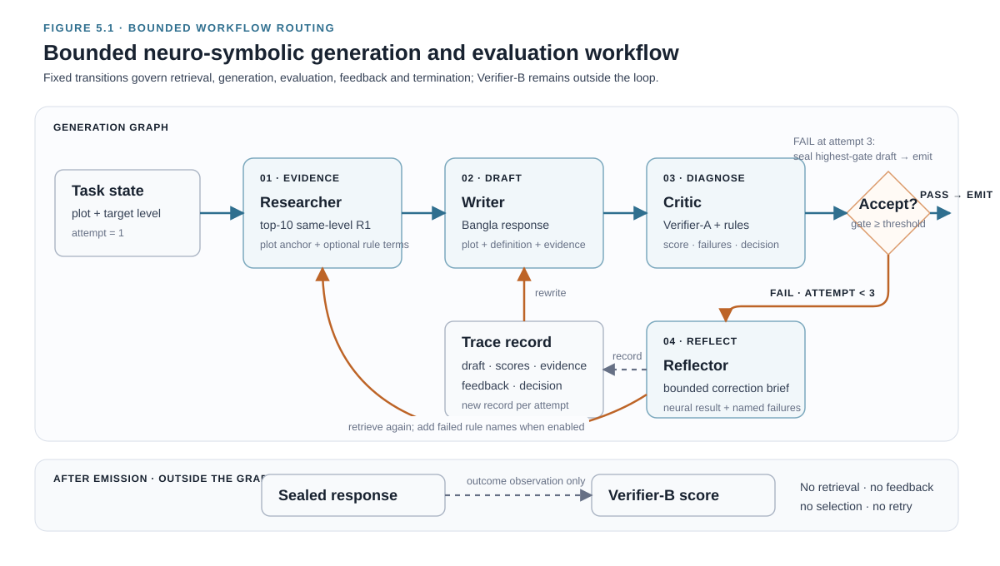
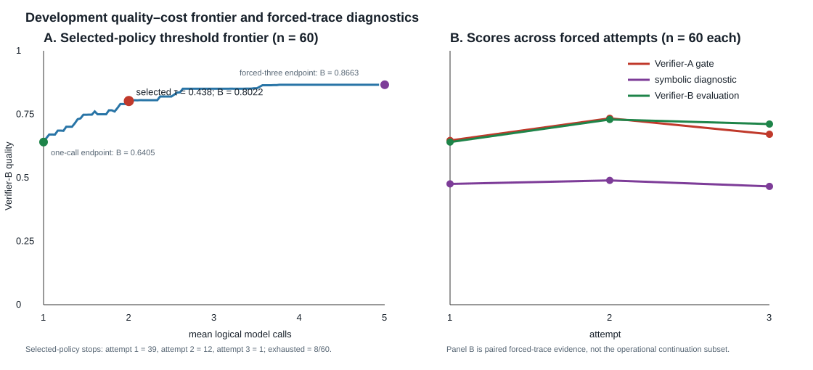

# Chapter 5 — Neuro-Symbolic Multi-Agent Framework

## 5.1 Chapter Overview

Chapters 3 and 4 defined the engagement-specificity levels and the two verifier
roles. This chapter specifies the bounded neuro-symbolic workflow used to
generate and revise Bangla cinema responses. The framework is the intervention
examined in RQ2 and RQ3; its outcome evidence is reported in Chapter 6.

The presentation follows the system's control structure. Section 5.2 defines
the functional roles, controller state, and bounded transition graph. Section
5.3 specifies generation, retrieval, prompting, and logical cost. Section 5.4
describes the neural gate, symbolic diagnostics, and development-set threshold
selection. Section 5.5 reports development diagnostics without treating them as
main-run evidence. Section 5.6 defines the ten experimental conditions and the
matched-budget resampling control. Sections 5.7 and 5.8 state the execution
contract and methodological limitations.

## 5.2 System Architecture

### 5.2.1 Functional Roles and State

The framework comprises four functional roles coordinated by an explicit state
graph:

1. **Researcher.** Retrieves the ten highest-similarity same-level exemplars
   from the frozen R1-only LaBSE index. It makes no model call; it is a
   deterministic tool caller over a fixed vector store.
2. **Writer.** Produces a Bangla cinema response at the requested level from
   the plot, the axis definition and the retrieved exemplars. This is the only
   role that generates a candidate response; the Reflector generates only a
   correction brief.
3. **Critic.** Applies Verifier-A to obtain the acceptance score and computes
   the symbolic diagnostics. It performs local inference with the frozen
   BanglaBERT-based Verifier-A, makes no generative-model or hosted-API call,
   and never loads Verifier-B.
4. **Reflector.** Converts the failed verdict and, where enabled, a set of named
   failed rules into bounded natural-language feedback for the next Writer
   attempt. It does not receive the numerical Verifier-A score.

The Researcher makes no model call. The Critic makes only deterministic local
Verifier-A and symbolic-scorer inference; it does not generate text or contact a
hosted model. The frozen Verifier-A artifact makes its score reproducible, and
the separate generation and outcome-scoring processes make the absence of
Verifier-B from the generation path auditable.

The Researcher follows the retrieval-augmented generation principle of supplying
external evidence before generation rather than relying on parametric recall
[@b8]. The separation of a learned neural decision from an inspectable symbolic
diagnosis follows recent neuro-symbolic verification work, with one deliberate
departure: here the symbolic output remains diagnostic and is never treated as
ground truth [@b20]. Section 5.5 reports the measurement that forced that
departure.

For a plot $p$, requested level $l$ and attempt $t$, the controller state is

$$
s_t=(p,\;l,\;q_t,\;E_t,\;y_t,\;a_t,\;r_t,\;f_t,\;c_t),
$$

where $q_t$ is the retrieval query, $E_t$ the retrieved exemplars, $y_t$ the
current draft, $a_t$ the Verifier-A score, $r_t$ the symbolic diagnostics, $f_t$
the feedback message and $c_t$ the accumulated logical cost. A transition either
accepts the current draft, revises the query and evidence and requests another
draft, or terminates at the registered retry ceiling. **Verifier-B is not a
state variable**, because no transition is permitted to consult it; its absence
from the state tuple formalises its outcome-only role.

Each completed attempt is serialised as a new trace record before the controller
advances. That record contains a fresh generation view, scalar scores, retrieved
identifiers, the gate decision and the feedback consumed by that attempt.
Feedback and the previous draft are then passed explicitly to the next Writer
prompt. This append-only trace structure preserves attempt-level provenance and
distinguishes revision from independent resampling.

Figure 5.1 shows the resulting routing. A passing draft is sealed immediately;
a failed non-terminal draft is reflected upon and retried; and a failure at the
third attempt emits the highest-gate draft with a `gave_up` flag. Verifier-B is
outside the graph and observes only sealed outputs.



*Figure 5.1. Bounded Researcher–Writer–Critic–Reflector routing. A failed
non-terminal attempt produces feedback and another retrieval-conditioned draft;
for the symbolic-feedback condition, failed-rule feature names augment the
plot-anchored retrieval query. A third-attempt failure emits the highest-gate
draft and records exhaustion. Verifier-B scores only sealed outputs.*

### 5.2.2 Bounded Control Flow

The term *multi-agent* is used here for functional decomposition with message
passing between roles that hold different information. It does not denote four
independently trained models, and it does not denote autonomy. Writer and
Reflector are the two model-calling roles; the Researcher is a retrieval role
and the Critic a deterministic neural–symbolic evaluation role. Each has a
distinct state contract, a distinct set of permitted inputs and a distinct
transition responsibility, and the persistent trace exposes the messages passing
between them.

What the controller may do is enumerable, and the enumeration is short: it may
retrieve, generate, evaluate, request feedback, retry, accept, or emit the
highest-gate draft when the attempt budget is exhausted. In conditions with
symbolic feedback, failed feature names augment the plot-anchored retrieval
query on retry; exemplar overlap is logged but does not determine routing. What
the controller may not do is
equally definite. It cannot alter the acceptance threshold, it cannot change the
data walls, it cannot raise the retry ceiling, it cannot select its own tools,
and it cannot modify the registered condition it is executing. The control flow
is fixed in advance and written as a small number of conditional branches. In
the vocabulary of compound language-model systems, this is an
**evaluator–optimizer workflow with a predefined control flow**: a generator
proposes, a separate evaluator scores, and a bounded number of revision rounds
follows. It is not an agent that plans its own trajectory.

The distinction matters for what may be claimed. Naming the system autonomous
would license conclusions about emergent coordination that this experiment
cannot support, and it would misattribute the observed improvement. Whatever
gain Chapter 6 reports is produced by external verification and bounded
revision, not by agency, and the design keeps those two explanations separable
by removing agency from the design.

The conservatism is also empirically motivated. A recent controlled comparison
found that multi-agent RAG decomposition improved structural consistency yet
matched a simpler single-agent pipeline on lexical quality while consuming
substantially more tokens [@b21]. The present ten-condition experiment tests
verification and revision mechanisms; it does not include a matched monolithic
reimplementation of the complete graph, and therefore it cannot establish that
role decomposition is itself beneficial. That absence is a scope limitation, not
an omission to be repaired by a stronger adjective.

## 5.3 Generation Pipeline

### 5.3.1 Generation Loop and Cost Model

Algorithm 5.1 specifies the parameterised controller used by the three RAG
verifier-loop conditions. The gate may be neural or symbolic, while symbolic
feature names are included in feedback only in the conditions that enable them.

```
Algorithm 5.1  Bounded verifier-in-the-loop generation

Input:  plot p, requested level l, threshold tau, gate type g
        symbolic-feedback flag h; roles R, W, C, F
Const:  T_max = 3; k = 10
Output: emitted draft y*, trace, gave_up flag, logical call count

 1  t <- 1; feedback <- null; failed <- []; previous_ids <- null
 2  trace <- []; candidates <- []
 3  while t <= T_max do
 4      keywords <- feature_names(failed) if h else null
 5      E <- R.retrieve(p, l, keywords, previous_ids, k)
 6      previous_ids <- identifiers(E)
 7      y <- W.generate(p, l, E, previous_draft, feedback)
 8      (a_score, r_score, failed) <- C.evaluate(y, l)
 9      gate <- a_score if g = neural else r_score
10      candidates <- candidates + {(y, gate, t)}
11      trace <- trace + snapshot(t, E, y, scores, feedback)
12      if gate >= tau then
13          return y, trace, gave_up = false
14      if t = T_max then
15          y* <- argmax candidates by (gate, -attempt)
16          return y*, trace, gave_up = true
17      feedback <- F.reflect(y, l, failed if h else [])
18      previous_draft <- y
19      t <- t + 1
```

*Algorithm 5.1. Parameterised bounded generation loop. Writer generation at
line 7 and non-terminal reflection at line 17 are the only language-model calls.
Retrieval and scoring are deterministic. The plot remains the retrieval-query
anchor; when symbolic feedback is enabled, feature names augment rather than
replace it.*

Five implementation guarantees follow from Algorithm 5.1 and are mapped to
executable tests in Appendix A.

**One Writer call per attempt, and one Reflector call per failure except the
last.** No Reflector call is made at the ceiling because no later Writer call can
consume its output. The forced-three endpoint used in Section 5.4.2 has three
Writer calls, two
Reflector calls and five logical calls in total, which is where the five-call
figure in Table 5.4 originates.

**The plot remains the retrieval anchor.** In symbolic-feedback conditions,
failed-rule feature names augment the plot text and never replace it.

**Retrieval overlap is diagnostic rather than a routing condition.** The
Researcher logs overlap between consecutive exemplar sets. The implemented
controller does not compare this value with 0.50 when choosing a transition;
every non-terminal failure performs the next retrieval step.

**Attempt records are append-only.** Line 11 constructs a new serialised record
from the current generation, scores, retrieved identifiers, decision and
feedback before the controller advances.

**Ties resolve to the earliest attempt.** At the ceiling, line 15 maximises the
pair comprising gate score and negative attempt index.

For a theoretical constant and independent per-attempt pass probability $q$,
charging one Writer call per attempt and one Reflector call per non-terminal
failure gives

$$
\mathbb{E}[\text{calls}] = 1 + 2(1-q) + 2(1-q)^2, \qquad
P(\text{accept}) = 1 - (1-q)^3 .
$$

Table 5.1 evaluates these expressions. It is a reference model rather than an
assumption about the observed attempt process; Section 5.5 reports that pass
rates vary across forced attempts.

**Table 5.1. Theoretical logical-call cost under a constant per-attempt pass probability**

| Per-attempt pass rate $q$ | $\mathbb{E}[\text{calls}]$ | $P(\text{accept})$ | Calls per accepted generation |
|---:|---:|---:|---:|
| 0.10 | 4.420 | 0.2710 | 16.310 |
| 0.30 | 3.380 | 0.6570 | 5.145 |
| 0.50 | 2.500 | 0.8750 | 2.857 |
| 0.65 | 1.945 | 0.9571 | 2.032 |
| 0.80 | 1.480 | 0.9920 | 1.492 |
| 0.99 | 1.020 | 1.0000 | 1.020 |
| 1.00 | 1.000 | 1.0000 | 1.000 |

Calls per accepted generation decrease monotonically as $q$ increases. A
cost-only criterion would therefore select the no-rejection policy, equivalent
to the lowest threshold. The registered threshold objective instead evaluates
quality gain relative to the one-call endpoint, with outcome quality measured by
Verifier-B [@b88]. Section 5.4.2 specifies this objective.

A worked trace containing retrieved identifiers, drafts, scores, Bangla
feedback, and the post-generation outcome score appears in Appendix E.7. The
example is the lexicographically first seed-42 hybrid case requiring more than
one attempt, selected by a deterministic rule rather than response quality.

### 5.3.2 Retrieval and Prompt Construction

The retrieval index holds **886 Region-A R1 reviews: 534 at Level 0 and 352 at
Level 1**, encoded with `sentence-transformers/LaBSE` in a cosine space as the
collection `r1_regionA_k2`. Embeddings are L2-normalized at encoding time so
that the store's inner product *is* cosine similarity, rather than being
converted to cosine afterwards. The index is the 804 Verifier-A training rows
plus the 82 development reviews. Including the development rows is admissible
because retrieval is not a fitted classifier and the threshold of Section 5.4.2 is
tuned on separate development *plots*, not on these reviews; nothing in the
index is used to fit an acceptance decision.

The index contains **zero R2 identifiers and zero Gold-300 identifiers**. Both
counts are checked in the index builder before any vector is written and checked
a second time against the split map directly, and the admitted row set carries
the digest `85fc2d7d7ad3281b9dd99a7a0a01f8221a5e7ab762d1c69a0924bbc4468b45bb`.
The manifest that records these facts is explicit that it certifies membership
and nothing about retrieval quality; no claim in this thesis rests on the
exemplars being good, only on their being admissible.

Retrieval requests the top ten exemplars at the requested level, with the level
filter applied **inside the query** rather than by filtering the results
afterwards. Post-filtering would return fewer than
ten exemplars whenever the unfiltered top ten straddle both levels, so the
Writer's prompt would silently vary in length between calls, and a prompt-length
difference correlated with retrieval difficulty would be indistinguishable from
a treatment effect. Filtering in the query keeps $k$ equal to ten for every
call.

A single prompt renderer supplies every condition. Zero-shot is the same base
prompt with no exemplars and no feedback; retrieval conditions add exemplars;
revision conditions add feedback. Constructing the baselines from the same
renderer prevents the most common way a verification result is inflated, namely
giving the baseline a weaker task definition than the treatment and then
attributing the difference to verification. Bangla characters are preserved
exactly, and the frozen prompt expresses the axis through positive prototypes of
each level rather than a list of forbidden cues, so that a model cannot satisfy
the instruction by avoidance alone.

The prompt imposes a uniform 20-word ceiling at both levels. This was introduced
to suppress the length confound identified in Chapter 3, and it reduced but did
not eliminate it. The confound deserves to be stated plainly here because it
bounds every level-recovery claim in the thesis: a word count alone recovers the
requested level at an AUC of 0.9111 under length control and 0.9894 at free
length. Recent work on decoupling length from specificity in description
evaluation shows why this cannot be dismissed as a nuisance parameter — length
and specificity are entangled in the construct itself, not merely in the
estimator [@b81]. The system therefore reports length diagnostics beside every
control result and never claims length neutrality.

## 5.4 Neural–Symbolic Control

### 5.4.1 Neural Gating and Symbolic Diagnosis

Verifier-A supplies the acceptance score, whereas the symbolic component names
the features responsible for a diagnostic failure. This division implements
constraint C6 and is evaluated through the weight-sensitivity analysis below.

The external diagnostic path exists because intrinsic self-correction is
unreliable when the model is asked to supply its own missing evidence: a model
that could identify the defect would in general have avoided it, and the
literature documents self-correction degrading outputs when no external signal
is available [@b5; @b6]. The Critic supplies exactly such an external signal,
and the Reflector's role is confined to translating it.

Whether the symbolic term should also *decide* was registered as a sensitivity
question rather than assumed either way. A hybrid gate score
$g = w \cdot a + (1-w) \cdot r$ was swept over a 21-point grid of $w$ under both
length-controlled and free-length development conditions, with three outcomes
pre-committed before any generation existed: `SYMBOLIC_INERT` if the curve were
flat, `SYMBOLIC_EARNS_ITS_PLACE` if a grouped held-out test favoured the
mixture, and `SYMBOLIC_HARMS` if neural-only beat the selected mixture.

The observed result matched none of them. Every one of five held-out folds,
grouped by plot, selected $w = 1.0$, with a mean $\Delta$AUC against neural-only
of exactly $+0.0000$ and a record of zero wins, five ties and zero losses. So
the mixture does not earn its place, and it also does not harm. Yet the curve is
demonstrably not flat: **50.8 per cent of generations under length control and
39.2 per cent at free length change PASS/FAIL somewhere across the range of
$w$.** A component that flips the verdict on between two and five of every ten
outputs is not inert. The registered decision rule does not classify this
combination, so the result
is recorded as `PRECOMMITMENT_UNRESOLVED`. Empirically, the symbolic term is
*consequential but not predictive*: it moves
acceptance decisions without improving the accuracy of those decisions. Those
two facts are jointly coherent, and together they are an argument for exactly the
placement the framework adopts. A signal that changes verdicts without improving
them must not be allowed to adjudicate; a signal that localizes a defect can
still be useful for saying *what* to fix. Consequently no single $w$ is selected,
no hybrid-accuracy claim is made anywhere in this thesis, and the symbolic module
is retained solely for failed-rule naming and feedback localization.

Table 5.2 explains why the symbolic scorer behaves this way, and the explanation
is more damaging to the adjudication reading than the held-out ties are. The
scorer is a logistic model over 11 features fitted on 82 development rows — 7.45
rows per feature — reaching 0.6570 macro-F1 by resubstitution but only
$0.5150 \pm 0.0713$ under stratified five-fold cross-validation, against a
majority baseline of 0.3926. Removing whole feature families and re-running
cross-validation localizes what little signal exists.

**Table 5.2. Leave-one-family-out analysis of the symbolic scorer**

| Omitted feature family | Cross-validated macro-F1 | Full-model F1 minus ablated F1¹ | Registered susceptibility to superficial optimisation |
|---|---:|---:|---|
| Length | 0.6232 | −0.1082 | Yes |
| Connectives | 0.5339 | −0.0189 | Yes |
| Sentiment markers | 0.5338 | −0.0188 | Yes |
| Lexical richness | 0.4764 | +0.0386 | No |
| Orthographic form | 0.4503 | +0.0647 | Yes |

¹Change is defined as full-model macro-F1 (0.5150) minus ablated-model
macro-F1; negative values therefore indicate improvement after omission.

A negative change means performance improved when the family was removed; a
positive change indicates that the omitted family carried predictive signal.
The two families that carry signal are orthographic form
and lexical richness, and orthographic form — the larger of the two — was
pre-registered as **gameable**. It is exactly the property a generator can
satisfy superficially once the Reflector names it. The pre-commitment recorded
in advance that a contribution concentrated in gameable families would be read
as a negative result about the hybrid design, and it is read that way here. The
striking entry is F2_length: removing length features improves cross-validated
performance by 0.1082, which means the symbolic scorer's length features were
actively harmful on held-out folds while length alone predicts the requested
level at above 0.91 AUC. The symbolic scorer is not failing to use length; it is
using it badly.

**Table 5.3. Requested-level discrimination across the neural–symbolic weight sweep ($n=120$ Bangla generations per condition)**

| Development condition | Symbolic-only AUC ($w=0$) | Neural-only AUC ($w=1$) | Bangla length-only AUC | Decision-change share across $w$ | Grouped five-fold result | Interpretation |
|---|---:|---:|---:|---:|---|---|
| Length-controlled | 0.3417 | 0.8333 | 0.9111 | 50.8% | $w=1$ in all folds; mean $\Delta$AUC=0.0000 | Registered outcomes did not cover the observed combination |
| Free-length | 0.0656 | 0.8658 | 0.9894 | 39.2% | $w=1$ in all folds; mean $\Delta$AUC=0.0000 | Registered outcomes did not cover the observed combination |

All AUCs in Table 5.3 use the requested level as the binary label. They measure
agreement with the generation instruction, not human-validated recovery of the
intended construct.

Two features of Table 5.3 should be read together. Symbolic-only AUC is not
merely weak but **below chance** — 0.3417 and 0.0656 — which means the symbolic
score is anti-correlated with the requested level rather than uninformative
about it; reversing its direction would yield a higher AUC. The
reference point for the neural column is not 0.5 but the length-only probe in
the adjacent column, which exceeds it in both conditions. Neither the symbolic
score nor the hybrid is the interesting comparison for this framework; the
length probe is, and Chapter 6 reports against it.

Where the symbolic component *is* permitted to gate — the registered
symbolic-loop condition of Section 5.6.1 — it uses its own threshold of
$\tau_{\text{sym}} = 0.1816651$, which accepts 39 of the 60 development cases.
That condition exists as a control on the neural loop, not as a competing
proposal, and its inclusion is what allows Chapter 6 to distinguish the effect of
*having* a gate from the effect of having a *good* gate.

### 5.4.2 Threshold and Stopping-Policy Selection

The acceptance threshold is selected on 60 held-out development plot-level cases
by a constrained cost objective adopted from calibrated cascade routing [@b88].
Following that formulation, the constraint is not free-floating but bounded by
the measured quality of the cheap and the expensive system, and the selected
operating point maximizes quality gained per unit of cost:

$$
\tau^{*} \;=\; \arg\max_{\tau}\;
\frac{Q_B(\tau)-\alpha_{\text{lo}}}{\mathbb{E}[\text{calls}\mid\tau]},
$$

where

- $Q_B(\tau)$ is outcome quality at threshold $\tau$, measured **by Verifier-B
  after the fact**;
- $\alpha_{\text{lo}} = 0.640501$ is the cheap endpoint: $\tau \to 0$, where the
  Critic never rejects, so every case emits its first retrieval-conditioned draft
  at exactly 1.000 calls and a first-pass rate of 1.000;
- $\alpha_{\text{hi}} = 0.866272$ is the expensive endpoint: forced three
  attempts on every case, with best-of-three selected by Verifier-A.

Both endpoint qualities are measured by Verifier-B on the same 60 development
cases. Verifier-A determines candidate stopping decisions but does not evaluate
the objective, preventing the in-loop gate from selecting its operating point
through a score it can directly influence.

Candidate thresholds are the observed gate scores. On the development score
distribution, a uniform grid from 0.30 to 0.95 would yield pass rates from 0.06
to 0.38 and repeat the same pass set at eight consecutive grid points. Observed
scores provide 81 distinct operating points. Scores are reported on the
temperature-calibrated scale,
which is admissible because temperature scaling is a monotone single-parameter
rescaling: every threshold on the calibrated scale has an exact twin on the raw
scale producing an identical PASS/FAIL partition, so the choice of scale affects
interpretability and nothing else [@b87].

**Table 5.4. Registered operating points on the 60-case development frontier**

| Quantity | One-call endpoint | Selected threshold ($\tau^{*}=0.4384071$) | Forced-three endpoint |
|---|---:|---:|---:|
| Verifier-B outcome score | 0.640501 | **0.802219** | 0.866272 |
| Mean logical model calls | 1.000 | **2.000** | 5.000 |
| First-attempt acceptance rate | 1.000 | **0.650** | Not applicable¹ |
| Final acceptance rate | 1.000 | **0.867** | Not applicable¹ |
| Exhausted cases | 0 | **8/60 (0.133)** | Not applicable¹ |
| Mean emitted-attempt index | 1.000 | **1.367** | 1.867 |
| Quality-gain-per-call objective | 0.000000 | **0.080859** | Not a candidate² |

¹The forced-three policy ignores acceptance and generates all three drafts.
²The forced-three policy defines the high-quality reference endpoint and was not
included among candidate threshold policies.

The forced-three endpoint costs five logical calls. Forcing
three Writer attempts also forces two Reflector calls, and the cost model of
Table 5.1 charges both. At $q = 0$ the model gives $1 + 2 + 2 = 5$, which is
the measured figure and provides a consistency check on the accounting.

The selected point's cost of 2.000 calls reconciles with the stopping
distribution in Section 5.5. Thirty-nine cases accept at attempt one
for one call each, twelve accept at attempt two for three calls, one accepts at
attempt three for five, and the eight cases that reach the ceiling spend five
each: $39 + 36 + 5 + 40 = 120$ calls over 60 cases, or 2.000. The constant-rate
model in Table 5.1 evaluated at the observed first-pass rate of 0.65 predicts
1.945, and the small discrepancy is informative rather than an error — the
per-attempt pass rate is not constant across attempts, as Section 5.5 shows.

Relative to the two registered frontier endpoints, the selected point captures
$(0.802219 - 0.640501)/(0.866272 - 0.640501) = 71.63$ per cent of the achievable
gain. Measured against a post-hoc Verifier-B oracle that picks the best of the
three attempts with full knowledge of the outcome score — a ceiling no
deployable policy can reach, since Verifier-B is forbidden from the loop — the
same point captures 69.74 per cent, and the forced-three policy captures 97.36
per cent. These quantities use different denominators and are therefore reported
separately.

Finally, one descriptive check on the threshold's behaviour across levels. A
permutation test on attempt-one mean gate score, Level 1 minus Level 0, gives an
observed difference of $+0.082894$ with 30 cases per level and 5,000 shuffles,
$p = 0.4687$ two-sided. This is registered as descriptive and **not** as a gate:
$p = 0.4687$ means the difference was not detected at this sample size, which is
not the same as the levels being equally easy. A single threshold is applied
globally to both levels, with per-level performance reported separately
throughout Chapter 6.

## 5.5 Development Diagnostics

The threshold frontier was computed from forced maximum traces containing three
drafts for every one of the 60 development cases. Consequently, the paired
attempt and transition statistics in Table 5.5 are diagnostics over the same 60
cases at every step; they are not conditional summaries of cases that would
actually continue under the selected stopping policy. None belongs to the frozen
5,400-case main-run surface.

**Table 5.5. Forced-trace attempt and transition diagnostics on 60 development cases**

**Panel A. Attempt-level summaries**

| Measure | Attempt 1 | Attempt 2 | Attempt 3 |
|---|---:|---:|---:|
| Mean Verifier-A score | 0.646845 | 0.734036 | 0.671316 |
| Mean symbolic diagnostic score | 0.475833 | 0.489569 | 0.465913 |
| Mean Verifier-B outcome score | 0.640501 | 0.729517 | 0.711472 |
| Share clearing the gate at $\tau^{*}$ | 0.650 | 0.750 | 0.683 |

**Panel B. Paired transition summaries**

| Measure | Attempt 1 → 2 | Attempt 2 → 3 |
|---|---:|---:|
| Mean change in Verifier-A score | +0.087190 (35 increase; 25 decrease) | −0.062719 (25 increase; 35 decrease) |
| Mean change in Verifier-B score | +0.089016 (31 increase; 29 decrease) | −0.018045 (23 increase; 37 decrease) |
| Mean change in symbolic score | +0.013737 (31 increase; 29 decrease) | −0.023656 (28 increase; 32 decrease) |
| Verifier-A/B directional disagreement | 18/60 | 18/60 |
| Mean normalised character edit distance | 0.665138 | 0.633043 |
| Mean change in word count | +0.033 | +0.283 |

Across the forced traces, the first revision increases mean Verifier-A and
Verifier-B scores by 0.0872 and 0.0890, respectively. The second revision
decreases them by 0.0627 and 0.0180, with Verifier-B declining for 37 of 60
cases. Mean character edit distances above 0.63 show that both transitions
contain substantial rewriting. These findings describe the registered
three-attempt design; because no fourth attempt was generated, they cannot
identify an optimal retry ceiling or support inference beyond three attempts.

The non-monotonic pattern is consistent with prior evidence that additional
self-correction rounds can degrade outputs when the correction signal no longer
offsets the perturbation introduced by rewriting [@b18]. Here, the pattern is
also observed by Verifier-B, which did not influence revision.

In each forced transition, the
in-loop scorer and the out-of-loop scorer disagree about whether the revision
improved the text on 18 of 60 cases. In the second transition the modal cell is
the one where both decline (27 cases), but the cell where the gate rises while
the outcome score falls holds 10 — cases in which the loop was, by its own
measure, succeeding and by an independent measure making things worse. That
divergence is measurable here only because Verifier-B was kept out of the loop.

The stopping distribution is as follows. Accepted stops occur at attempts one,
two and three for 39, 12 and 1 cases respectively, and 8 cases reach the ceiling
without acceptance, giving 52 accepted of 60. The distribution of *emitted* best
attempts is 41, 16 and 3, which differs from the accepted-stop distribution
because a case that reached the ceiling still emits its highest-scoring draft,
and that draft need not be the last one.

The eight exhausted cases are selected by the gate rather than sampled randomly.
Their mean Verifier-B score is **0.503921**, compared with **0.848111** for
accepted cases and 0.802219 overall. This association shows why accepted-only
means must be accompanied by coverage; it does not establish why these cases
were rejected. Six of the eight are Level-1 requests
(BN046, BN048, BN066, BN105, BN110, BN115) against two Level-0 requests
(BN043, BN063). Level 1 is the sparser side of the retrieval index at 352 rows
against 534, so the direction is at least consistent with an evidence-supply
explanation; with eight cases no test is warranted and none is performed, and
the permutation result in Section 5.4.2 did not detect a level difference in
attempt-one scores.

A second, larger-sample descriptive quantity points the same way. Against the
post-hoc outcome oracle of Section 5.4.2, the selected threshold captures 82.00
per cent of the available gain on Level-0 requests but only 39.07 per cent on
Level-1 requests. Both figures are registered as post-hoc descriptive and
neither is a selection rule, but the gap between them is more than twofold and
rests on 30 cases per level rather than on eight. Together with the
ceiling-failure split, this asymmetry motivates level-wise reporting in Chapter
6. It does not establish that retrieval density caused the difference; index
density and observed outcomes are associated rather than experimentally
separated.

The registered protocol called for a coded failure taxonomy over a sample of
**fifty** cases. The complete census of ceiling failures at the selected
threshold contains **eight**, so the planned sample does not exist and the
taxonomy was coded over the census instead. Of the eight, one is coded
`off_topic` — a draft asserting that a film was Ritwik Ghatak's last work, which
is false — and two fall into a post-hoc `other` category covering a medium
misidentification (a film described as a serial, *সিরিয়াল*) and a
specificity-level mismatch. The remaining **five exhibit no observable
registered error at all**. Coding was performed by a single coder with the
researcher's explicit authorization and reviewed by the researcher; no
independent second coder was used, so no inter-coder agreement statistic exists.

Three limitations follow. First, with eight cases the smallest
resolvable proportion is one in eight, so any failure mode whose true prevalence
is below roughly twelve per cent is expected to be absent from this census
altogether; the four categories recording zero counts are uninformative rather
than falsified. Second, inter-coder reliability cannot be estimated, so the
coding cannot support claims about reproducible category assignment. Third,
five of the eight failures could not be
described by any registered category. That is a finding about the instrument, not
only about the sample: the registered taxonomy failed to describe most of its own
census. The correct conclusion is therefore narrow. These eight are a complete
description of ceiling failures at this threshold on these development cases; no
population-level claim about failure prevalence, and no claim that the taxonomy
is adequate, is made from them. The deviation is logged in the protocol, and the
per-case census appears in Appendix E.6.

Figure 5.2 shows the frontier and the attempt-level dynamics together.



*Figure 5.2. Development quality–cost frontier and forced-trace diagnostics. The selected
threshold ($\tau^{*}=0.438$) is an interior operating point between the one-call
retrieval endpoint and forced-three revision, not the maximum-quality endpoint.
The attempt-level panel summarises paired forced traces for all 60 cases and
therefore does not represent only the subset that would operationally continue
at each step. These development cases are not part of the frozen 5,400-case
result surface.*

## 5.6 Experimental Design

### 5.6.1 Experimental Conditions

The main experiment instantiates ten conditions through the same prompt renderer
and the same data contracts: zero-shot, instance-randomized static few-shot,
retrieval-only, the neural loop, the symbolic loop, the neural loop with
symbolic feedback, intrinsic self-critique, external-role self-critique, a
large-model judge loop, and blind resampling. The two self-critique arms
instantiate the established iterative-refinement and verbal-feedback
formulations [@b13; @b14], and they are controls rather than proposals: they test
whether the improvement attributed to the framework requires an external verifier
at all, or whether a model criticizing its own draft suffices.

**Table 5.6. Registered intervention and computational contracts for the ten experimental conditions**

**Panel A. Intervention definition**

| Condition | Initial evidence | Control or selection signal | Revision mechanism |
|---|---|---|---|
| Zero-shot | None | None | None; first draft emitted |
| Static few-shot | Ten instance-randomised, same-level R1 examples | None | None; first draft emitted |
| RAG-only | Top-10 same-level R1 retrieval | None | None; first draft emitted |
| RAG + neural loop | Top-10 same-level R1 retrieval | Verifier-A; $\tau=0.4384071$ | Generic bounded feedback; plot-only re-retrieval |
| RAG + symbolic loop | Top-10 same-level R1 retrieval | Symbolic score; $\tau=0.1816651$ | Named symbolic failures; failed-feature query augmentation |
| RAG + neural gate and symbolic feedback | Top-10 same-level R1 retrieval | Verifier-A; $\tau=0.4384071$ | Neural result and named failures; failed-feature query augmentation |
| Intrinsic self-critique | Top-10 same-level R1 retrieval | Model-generated critique | Identical critique placed in the assistant role |
| External-role self-critique | Top-10 same-level R1 retrieval | Model-generated critique | Identical critique placed in the user role |
| Hosted-judge loop | Top-10 same-level R1 retrieval | Judge PASS/FAIL and target-fit score | Bounded judge feedback |
| Blind resampling | Top-10 same-level R1 retrieval | Verifier-A ranking within a same-case model-token-budget prefix | Independent candidate sampling; no revision |

**Panel B. Computational and isolation contract**

| Condition group | Maximum Writer calls | Maximum auxiliary calls | Verifier-B access during generation |
|---|---:|---:|---|
| Zero-shot, static few-shot, and RAG-only | 1 | 0 | None |
| Neural, symbolic, and neural-gate/symbolic-feedback loops | 3 | 2 Reflector calls | None |
| Intrinsic and external-role self-critique | 2 | 1 critique call | None |
| Hosted-judge loop | 3 | 3 judge calls | None |
| Blind resampling | 5 candidates generated; matched prefix analysed | 0 | None |

Three design points in Table 5.6 carry more weight than their single table rows
suggest.

**The two self-critique arms differ only in message role.** Both receive a
byte-identical critique string; one places it in the assistant role and the
other in the user role. Identity is enforced by comparing SHA-256 digests of the
UTF-8 encoded critique before the pair is admitted, so the contrast isolates
message placement and nothing else. This is a deliberately narrow manipulation
whose purpose is to detect whether an apparent self-correction effect is in fact
a prompt-formatting effect.

**The judge condition uses a specific model, and it is named.** The judge is
`gemma-4-26b-a4b-it`, accessed over the provider's interactions interface with
seed 42, high reasoning effort, and a 512-token output ceiling, under a
registered enumerated feedback contract. It sees the plot, the requested level,
the draft and the rubric, and it never sees a Verifier-A or Verifier-B score.
Transport-level retries — three are permitted — are not logical model calls and
are not charged as such, since a retried request produces one verdict. Naming
the judge matters because a judge condition is not reproducible against an
unnamed model. This condition provides a strong contrasting control: it asks
whether a small frozen probe inside the loop can match a separately hosted
same-family model that reasons about the same draft. It is not described as an
independent-family judge.

**Blind resampling is a matched-budget control.** It generates five independent
retrieval-conditioned samples to establish a common nested frontier, then lets
Verifier-A select only within the budget-admissible prefix. This reconstructs
verifier-ranked candidate selection as
introduced by Cobbe and colleagues, in which a trained verifier scores many
sampled completions and the highest-ranked is returned [@b58]. The difference
from the loop conditions is precisely one thing: here the verifier only *ranks*
and never triggers a revision. Recent matched-compute studies report conflicting
refinement-versus-resampling outcomes across tasks, which is why this control is
necessary because an apparent loop advantage could otherwise reflect additional
generation budget [@b16; @b17]. Section 5.6.2 states the
selection rule that keeps the comparison matched.

The eight retrieval-based conditions from RAG-only through blind resampling
share a byte-identical initial retrieval-
conditioned draft at each plot–level–replicate key, while still being charged
their own logical cost. This paired schedule removes irrelevant sampling
variation from every comparison among them without concealing any of their cost.
Table 6.1 counts both text generations and auxiliary calls, so a verifier loop
can exceed three logical calls without exceeding three Writer drafts; the
ceilings in Table 5.6 describe the treatment contracts, and realized costs are
reported in Chapter 6. Verifier-B appears only after generation, for outcome
scoring.

### 5.6.2 Matched-Budget Resampling

A resampling control is informative only if its primary selector is not credited
with more model-token budget than the loop it is compared against. The naive
analysis — generate five samples and keep the best of all five — is not matched,
because the loop rarely reaches its full logical-call ceiling: at the selected
threshold it averages 2.000 calls against a ceiling of five. Comparing the
unrestricted five-sample maximum with that loop would confound mechanism with
budget.

Algorithm 5.2 states the implemented rule. The budget is the total realised
model-token count of the neural-gate/symbolic-feedback loop on the same case,
including prompt and completion tokens for its Writer and Reflector calls. The
selector may consider only the largest nested candidate prefix whose cumulative
token count fits within that budget.

All five candidates were generated once so that the same frozen outputs could
support the registered nested-prefix analysis. Consequently, the matching
applies to the candidates admitted to the primary comparison and to their
accounted model-token cost; it is not a claim that the one-off experimental run
consumed no resources on the excluded suffix.

```
Algorithm 5.2  Largest nested prefix within a matched budget

Input:  candidate token counts c[1..n] in generation order
        token budget B                                 (realised loop tokens
                                                        on the same case)
Output: m, the number of candidates the selector may consider

 1  if B <= 0 or n = 0 then
 2      raise ContractError("budget and candidate pool must be positive")
 3  total <- 0;  m <- 0
 4  for i <- 1 to n do
 5      if c[i] is not finite or c[i] <= 0 then
 6          raise ContractError("each candidate cost must be positive")
 7      total <- total + c[i]
 8      if total <= B then
 9          m <- i
10  if m = 0 then
11      raise ContractError("loop budget cannot fund even one sample")
12  return m
```

*Algorithm 5.2. Matched-budget prefix selection. The selector then applies
Verifier-A to candidates 1 through m and emits the highest-scoring one.
Candidates are consumed in generation order, so the admitted set is a prefix and
never a subset chosen with knowledge of the scores.*

Three properties define the matching contract.

The admitted set is a **prefix in generation order**, not an arbitrary subset.
Choosing candidates after observing their scores would violate the registered
generation-order prefix.

The budget is the **realised same-model token count on the same case**, not the
loop's nominal ceiling. A case accepted immediately therefore admits fewer
resamples than a case revised twice.

This quantity is an implementation-level compute proxy, not a measurement of
hardware FLOPs. It includes prompt processing and generated tokens under the
same 12B model, but it does not equalize hardware utilization, latency, or the
functional role of the calls: loop tokens include Writer and Reflector calls,
whereas resampling tokens are all candidate-generation calls. The analysis
therefore describes the condition as *model-token-budget matched*, not
FLOPs-matched. The excluded suffix remains part of the archived candidate
frontier but contributes neither to selection nor to the primary condition's
reported logical cost.

**Insufficient funding raises rather than degrades.** If the loop's realized
budget cannot fund even one sample, the contract raises an error instead of
silently emitting a zero-candidate or unpriced result. A control that quietly
falls back when its budget is exhausted produces a comparison whose matching
holds only on the cases where matching was easy.

## 5.7 Execution and Reproducibility

The frozen Writer is `google/gemma-3-12b-it`, loaded locally with 4-bit
NormalFloat quantization, generating at `max_new_tokens=80`, temperature 0.8 and
top-p 0.9 under the 20-word prompt ceiling described in Section 5.3.2. Replicate
seeds 42, 43 and 44 are crossed with every evaluation plot, level and condition,
yielding the frozen surface of 5,400 cases: 90 plots by 2 levels by 10
conditions by 3 replicates. The replicates are paired sensitivity blocks and are
**not** independent experimental replications, and Chapter 6's inferential family
treats them accordingly.

Ingestion is gated before any model loads: a checkpoint must present the exact
registered key set, parse as valid and unique JSON records, and carry an allowed
clean producing commit. The judge condition additionally archives its structured
verdict, target-fit score, feedback, token usage and model version. Every
completed case records the plot identifier, target level, condition, replicate
seed, prompt arm, attempt count, emitted draft, logical calls and tokens, and
stopping status. Outcome scoring runs as a separate process after generation and
joins on the frozen case key.

The remaining execution detail — the complete configuration-to-output map, the
runtime environments, the artifact lineage and the statistical contract — is
specified in Appendix A and is not restated here. Two boundaries, however, are
substantive enough to belong in the chapter that defines the framework. Global
seed 42 initializes every script as its first action, so the loop's routing is
reproducible rather than merely recorded. And the live local demonstration
interface **is not the frozen experiment**: it runs a hosted judge-family Writer
and an additional operational plot-support check, whereas the main run uses
frozen local Gemma-3 generation with outcome-only Verifier-B. It persists no
prompts, contributes no evidence to any result in this thesis, and is documented
as diagnostic software in Appendix H.

## 5.8 Limitations

The framework and its development evidence have six principal limitations.
First, threshold selection and the associated frontier are estimated on the same
60 development cases; the frozen evaluation surface is required to assess
generalisation. Second, all attempt-level comparisons use forced three-attempt
traces. They describe counterfactual revisions for every case and must not be
interpreted as the conditional behaviour of only those cases that would have
continued under the selected policy, nor can they identify an optimal retry
ceiling beyond the three attempts observed. Third, the Bangla corpus has no
movie identifier. Retrieval can therefore be constrained by engagement level
and corpus partition, but cannot supply film-specific audience evidence.

Fourth, requested level remains strongly recoverable from output length on the
development generations (length-only AUC 0.9111 under the common 20-word
instruction), so the study does not claim length-neutral control. Fifth, the
symbolic scorer is trained on only 82 labelled development rows, has weak
cross-validated performance, and changes decisions without improving grouped
held-out AUC. Its defensible role is diagnostic feedback rather than independent
adjudication. Sixth, the failure taxonomy covers only eight exhausted cases and
was single-coded with researcher review; category prevalence and inter-coder
reliability are therefore not estimable. In addition, exemplar overlap is
recorded only as a diagnostic because the registered overlap-based routing rule
was not implemented, and the blind-resampling comparison matches realized
same-model tokens rather than measured hardware FLOPs. These departures are
recorded in the protocol and constrain the interpretation of Chapters 6 and 7.

## 5.9 Chapter Summary

The framework specified here operationalizes external verification as an
inspectable state machine rather than as an opaque *agent*. Four roles are
defined: the Researcher performs deterministic retrieval, the Writer and
Reflector make generative calls, and the Critic performs deterministic local
inference. Acceptance is decided by a frozen linear probe whose determinism is
what makes the Chapter 4 isolation wall enforceable; the symbolic component
explains failures without adjudicating them; and an outcome verifier that never
touches the loop makes overoptimization measurable.

The development analysis establishes three operational choices. The cost model
shows that cost minimisation without a quality constraint collapses to a gate
that never rejects; the selected operating point therefore maximises recovered
outcome quality per expected call relative to measured endpoints. The weight
sweep shows that the symbolic term changes decisions without improving grouped
held-out AUC, so it is used for diagnostic feedback rather than for the primary
neural gate. Forced-trace diagnostics show an average improvement from attempts
one to two and an average decline from attempts two to three; these observations
characterise the registered three-attempt controller but do not determine that
three is an optimal ceiling.

Three quantities in this chapter should be carried into the next. The selected
threshold buys 71.63 per cent of the frontier's achievable gain at 2.000 of a
possible 5.000 logical calls; cases that reach the ceiling emit markedly weaker
text (mean outcome score 0.503921 against 0.848111), so coverage must be read
beside every conditional mean; and the in-loop and out-of-loop verifiers already
disagree about the direction of revision on 18 of 60 development cases before the
main experiment begins. Chapter 6 evaluates this architecture against nine
matched alternatives on the frozen 5,400-case surface, and reports what that
disagreement becomes at scale.
