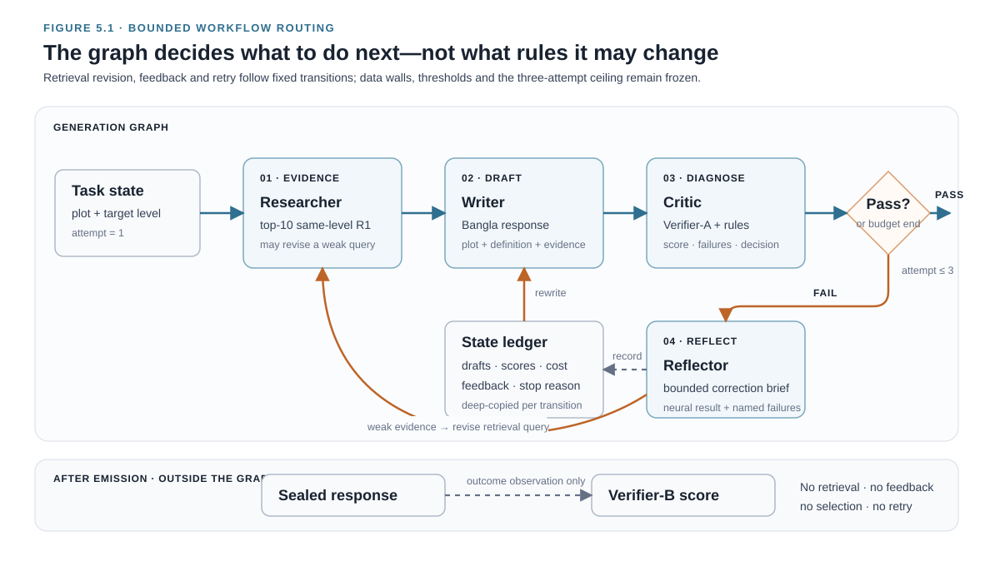
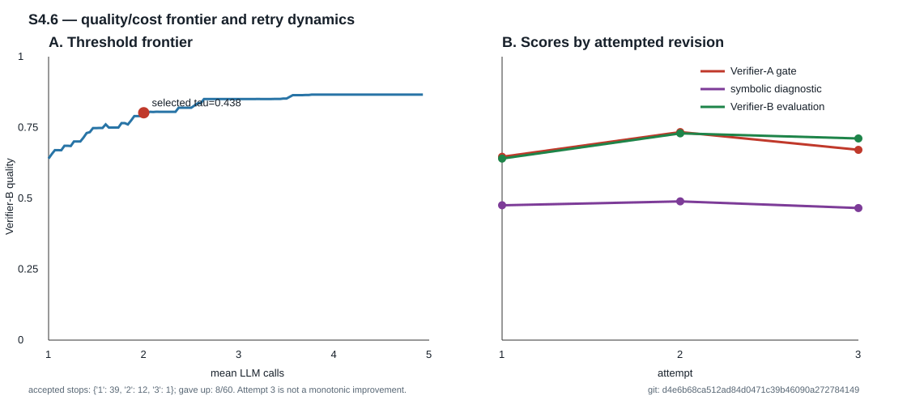

# Chapter 5 — Proposed Neuro-Symbolic Multi-Agent Framework

This chapter presents the proposed framework as an executable design rather
than as an informal collection of prompts. It first defines the four functional
roles and their permitted information, then describes retrieval, prompting,
neural gating, symbolic diagnosis, threshold selection, and stopping. The final
sections specify the ten experimental conditions and the frozen execution
contract used to evaluate them.

## 5.1 Framework architecture and state

The compound system contains four functional agents coordinated by an explicit
state graph:

1. **Researcher:** retrieves the top ten same-level examples from the frozen
   R1-only LaBSE/Chroma index.
2. **Writer:** produces a Bangla cinema response for the requested level using
   the plot, axis definition, and retrieved examples.
3. **Critic:** applies Verifier-A and computes symbolic diagnostics; it never
   loads Verifier-B.
4. **Reflector:** converts the score and named failed rules into bounded feedback
   for the next Writer attempt.

The Researcher follows the retrieval-augmented generation principle of adding
external evidence before generation [@b8]. The separation of a learned neural
decision from inspectable symbolic diagnosis follows recent neuro-symbolic
verification work, while the present implementation keeps the symbolic output
diagnostic rather than treating it as ground truth [@b20].

The graph records every attempt, score, diagnostic, feedback string, token count,
latency, and stopping reason. State snapshots are deep-copied before mutation,
and ties select the earliest attempt because an equal later draft has not earned
its extra cost. At most three logical Writer attempts are permitted in the
primary loop.

For a plot (p), requested level (l), and attempt (t), the controller state
can be summarized as

\[
s_t=(p,l,q_t,E_t,y_t,a_t,r_t,f_t,c_t),
\]

where (q_t) is the retrieval query, (E_t) the retrieved examples, (y_t)
the current draft, (a_t) the Verifier-A score, (r_t) the symbolic
diagnostics, (f_t) the feedback message, and (c_t) the accumulated logical
cost. A transition either accepts the current draft, revises the query and
evidence, requests another Writer draft, or terminates at the registered retry
ceiling. Verifier-B is not a state variable because no transition may consult
it.

*Figure 5.1. Bounded routing in the Researcher–Writer–Critic–
Reflector graph. A failed Critic decision can trigger feedback, rewriting and,
when evidence is weak, a revised retrieval query. Thresholds and a maximum of
three Writer attempts bound the routing. Verifier-B remains outside the graph
and scores only sealed outputs.*

### 5.1.1 Why this is a multi-agent workflow, not an autonomous-agent claim

The term *multi-agent* denotes functional decomposition and message passing,
not four independently trained language models. Writer and Reflector are the
two model-calling roles; Researcher is a retrieval/tool role and Critic is a
deterministic neural–symbolic evaluation role. Each has a distinct state
contract, permitted inputs, and transition responsibility, and the persistent
trace exposes their intermediate messages. The controller may retry, revise a
query after weak evidence, or stop, but it cannot alter thresholds, data walls,
the retry ceiling, or the registered condition. The implementation is therefore
a **bounded multi-agent workflow**, not an open-ended autonomous multi-agent
system.

This terminology is deliberately conservative. A recent controlled comparison
found that multi-agent RAG decomposition could improve structural consistency
yet match a simpler single-agent pipeline on lexical quality while consuming
substantially more tokens [@b21]. The present ten-condition experiment tests
verification and revision mechanisms; it does not contain a matched monolithic
reimplementation of the complete graph and therefore does not establish that
role decomposition itself is superior.

## 5.2 Retrieval and shared prompt contract

The RAG index contains 886 region-A R1 reviews: 534 at Level 0 and 352 at Level
1. It includes the 804 Verifier-A training rows plus 82 development reviews,
because retrieval is not a fitted classifier and threshold tuning occurs on
separate development plots. It contains zero R2 and zero Gold-300 identifiers.

One prompt renderer supplies every condition. Zero-shot is the same base prompt
with no exemplars or feedback; RAG conditions add retrieved examples; revision
conditions add feedback. This construction prevents a baseline from receiving a
weaker task definition than a loop condition. Bangla characters are preserved,
and the frozen prompt contract expresses the axis through positive prototypes
rather than a list of forbidden cues.

The prompt uses a uniform 20-word ceiling at both levels. This reduced but did
not eliminate the generated-length confound. The system therefore reports
length diagnostics beside control results and never claims length neutrality.

## 5.3 Neural gating and symbolic diagnosis

Verifier-A supplies the acceptance score in the proposed loop. Symbolic checks describe observable
features such as insufficient specificity or problematic form, but are not
combined into a claimed predictive hybrid score. This external diagnostic path
addresses the limitation that unsupported intrinsic self-correction does not
reliably supply its own missing evidence [@b5; @b6]. A 21-point `w` sensitivity
curve was evaluated under length-controlled and free-length conditions. Every
grouped held-out fold selected w=1.0, and the mean delta AUC relative to
neural-only was 0.0000. Symbolic-only AUC was 0.3417 under length control and
0.0656 at free length, both below neural-only (0.8333 and 0.8658).

The curve was nevertheless verdict-sensitive: 50.8% and 39.2% of generations
changed PASS/FAIL somewhere across w. This observed combination was missing from
the three preregistered outcomes, so the correct audit state is
`PRECOMMITMENT_UNRESOLVED`. No fourth outcome is invented, no single hybrid
weight is selected, and symbolic information is retained only for failed-rule
naming.

## 5.4 Threshold and stopping-policy selection

The neural threshold is selected on 60 held-out development plot-level cases by
the preregistered frontier objective

\[
\tau^* = \arg\max_\tau
\frac{Q_B(\tau)-\alpha_{lo}}{E[\mathrm{calls}\mid\tau]},
\]

where outcome quality is measured by Verifier-B after the fact and Verifier-B
never enters the loop. The lower endpoint is one-call RAG-only, not zero-shot;
the upper endpoint is forced-three revision.

The selected threshold is \(\tau^*=0.4384071\). At this point Verifier-B quality
is 0.802219, expected calls equal 2.000, first-pass acceptance is 0.6500, final
acceptance is 0.8667, and 8/60 cases give up. The one-call endpoint is 0.640501
and the forced-three endpoint 0.866272; the chosen operating point captures
71.63% of the achievable gain. A descriptive level-score permutation gives
delta +0.08289, p=0.4687; this means “not detected,” not “equal.”

## 5.5 Loop dynamics

At the selected threshold, accepted stops occur at attempts 1/2/3 for 39, 12,
and 1 cases; eight give up. The emitted-best attempts are 41/16/3 because a
gave-up case can emit an earlier higher-scoring draft. Attempt 1→2 improves mean
Verifier-A by +0.08719 and Verifier-B by +0.08902. Attempt 2→3 regresses by
-0.06272 and -0.01805 respectively, with Verifier-B declining in 37/60 cases.
A and B disagree on revision direction for 18/60 cases in each transition.

The post-hoc Verifier-B oracle reaches 0.872402, while A-selected forced-three
reaches 0.866272, or 97.36% of the available oracle gain. This is diagnostic
only; it is not a deployable selector because B is forbidden from the loop.
These dynamics justify the bounded retry budget and show why more iterations
cannot be assumed beneficial [@b18].

*Figure 5.2. Development quality–cost frontier and retry dynamics. The selected
threshold (tau=0.438) is an operating point between the one-call RAG endpoint
and forced-three revision, not the maximum-quality endpoint. Attempt-level
means show that a third revision is not monotonically beneficial; these 60
development cases are not part of the frozen 5,400-case result surface.*

## 5.6 Development failure taxonomy

The final development failure set contains eight cases, rather than the planned
sample of fifty. One is coded off-topic, two fall into a post-hoc `other`
category, and five show no observable registered error. Initial coding was
performed with generative-AI assistance and reviewed by the researcher; no
independent second coder was used. Inter-coder agreement is therefore not
available. The taxonomy is a complete description of the eight observed
failures, but its reduced sample and lack of independent coding are protocol
deviations and prevent population-level claims about failure prevalence.

## 5.7 Ten experimental conditions

The main experiment instantiates ten conditions through the same underlying
prompt and data contracts: zero-shot, randomized static few-shot, RAG-only,
neural loop, symbolic loop, neural loop with symbolic feedback, intrinsic
self-critique, external-role self-critique, hosted Gemma-4 judging, and blind
resampling. The two self-critique controls reflect established iterative
refinement and verbal-feedback formulations [@b13; @b14]. Conditions 3–9 share a byte-identical initial RAG draft for each
plot/level/replicate while retaining logical cost. This paired schedule reduces
irrelevant sampling variation.

The hosted Gemma-4 judge sees the plot, requested level, draft, and rubric but no
Verifier-A/B score. Blind resampling draws up to five independent RAG samples and
lets Verifier-A select the best prefix under a matched compute budget. Both are
strong controls: one tests a large external judge and the other tests whether
fresh sampling can match refinement. Recent matched-compute studies report
conflicting refinement-versus-resampling outcomes across tasks, making the
resampling control necessary rather than decorative [@b16; @b17].

**Table 5.1. Frozen ten-condition intervention matrix**

| Condition | Example source | Acceptance/selection signal | Revision feedback | Max Writer calls | Max auxiliary calls | Verifier-B in loop |
|---|---|---|---|---:|---:|---|
| Zero-shot | None | None; emit first draft | None | 1 | 0 | No |
| Static few-shot | 10+10 instance-randomized R1 examples | None; emit first draft | None | 1 | 0 | No |
| RAG-only | Top-10 same-level R1 retrieval | None; emit first draft | None | 1 | 0 | No |
| RAG + neural loop | Top-10 R1 retrieval | Verifier-A, τ=0.4384071 | Neural score-derived bounded feedback | 3 | Up to 2 Reflector | No |
| RAG + symbolic loop | Top-10 R1 retrieval | Symbolic score, τ=0.1816651 | Named failed symbolic rules | 3 | Up to 2 Reflector | No |
| RAG + neural + symbolic feedback | Top-10 R1 retrieval, query revised by failed-rule keywords | Verifier-A, τ=0.4384071 | Neural result plus named symbolic failures | 3 | Up to 2 Reflector | No |
| Intrinsic self-critique | Top-10 R1 retrieval | Model self-critique | Critique placed in assistant role | 2 | 1 critique | No |
| External-role self-critique | Top-10 R1 retrieval | Same byte-identical critique | Critique placed in user role | 2 | 1 critique | No |
| Gemma-4 judge loop | Top-10 R1 retrieval | Hosted Gemma-4 PASS/FAIL and target-fit score | Bounded judge feedback | 3 | Up to 3 judge | No |
| Blind resampling | Top-10 R1 retrieval | Verifier-A selects best candidate prefix | None; fresh samples | Up to 5 | 0 | No |

Conditions 3–9 share the same initial RAG draft at each registered key. Writer
and auxiliary ceilings describe the treatment contracts. Table 6.1 counts both
kinds of model generation, so a verifier loop can exceed three logical calls
without exceeding three Writer drafts. Realized costs are reported in
Table 6.1. Verifier-B appears only after generation for outcome scoring.

**Table 5.2. Neural–symbolic weight sensitivity and registered interpretation**

| Development condition | n | Symbolic-only AUC (`w=0`) | Neural-only/best AUC (`w=1`) | Length-only AUC | Outputs changing verdict somewhere on curve | Held-out mixture Δ vs neural | Standing |
|---|---:|---:|---:|---:|---:|---:|---|
| Length-controlled | 120 | 0.3417 | 0.8333 | 0.9111 | 50.8% | +0.0000; 0 wins, 5 ties, 0 losses | `PRECOMMITMENT_UNRESOLVED` |
| Free-length | 120 | 0.0656 | 0.8658 | 0.9894 | 39.2% | +0.0000; 0 wins, 5 ties, 0 losses | `PRECOMMITMENT_UNRESOLVED` |

The curve is not flat, so symbolic information is not inert; held-out folds do
not favor it, so it has no established incremental predictive value. No hybrid
weight or hybrid-accuracy claim is selected. Symbolic rules remain diagnostic
feedback only.

## 5.8 Main-run execution contract

The frozen Writer is `google/gemma-3-12b-it`, loaded locally using 4-bit
NormalFloat (NF4)
quantization. Generation uses `max_new_tokens=80`, temperature 0.8 and top-p
0.9. The prompt places the same 20-word ceiling on both requested levels.
Replicate seeds 42, 43 and 44 are crossed with every evaluation plot, level and
condition. They are paired sensitivity blocks, not independent experimental
replications.

For each plot–level–replicate key, zero-shot and static few-shot receive their
registered prompts, while conditions 3–9 reuse one byte-identical initial RAG
generation before applying their distinct intervention. Blind resampling starts
from the same RAG prompt and selects the largest candidate prefix within the
realized neural-plus-symbolic token budget. The hosted judge condition archives
its structured verdict, target-fit score, feedback, usage and model version;
provider retries are transport operations and do not count as logical model
calls.

Every completed case records plot ID, target level, condition, replicate seed,
prompt arm, attempts, emitted draft, logical calls/tokens and stopping status.
Checkpoint ingestion requires the exact registered key set, valid unique JSON
records and an allowed clean producing commit before any model loads. The final
outcome scorer runs separately after generation and joins by the frozen case
key.

## 5.9 Reproducibility and safety boundaries

Global seed 42 initializes every script; main generation replicates are fixed at
42, 43, and 44. Every config maps to named outputs with git commit and runtime
provenance. Checkpoints must parse fully, have unique registered keys, and match
an allowed clean producing commit. Raw provider payloads and superseded calls are
archived separately and cannot occupy active resume paths.

The live local interface is not the frozen experiment. It uses a hosted Gemma-4
Writer and an additional operational plot-support check, whereas the main run
uses frozen Gemma-3 generation and outcome-only Verifier-B. The demo neither
persists prompts nor changes Phase-5 results and must be presented as diagnostic
software.

## 5.10 Chapter summary

The system operationalizes external verification as an inspectable state machine
rather than an opaque “agent” label. Neural gating decides, symbolic rules
explain, the Reflector translates diagnosis into feedback, and a separate
Verifier-B makes overoptimization visible. Development results establish a
useful two-attempt region, diminishing third-attempt returns, no predictive case
for a hybrid score, and the necessity of strict data and evaluator walls. The
next chapter evaluates this architecture against nine matched alternatives.
