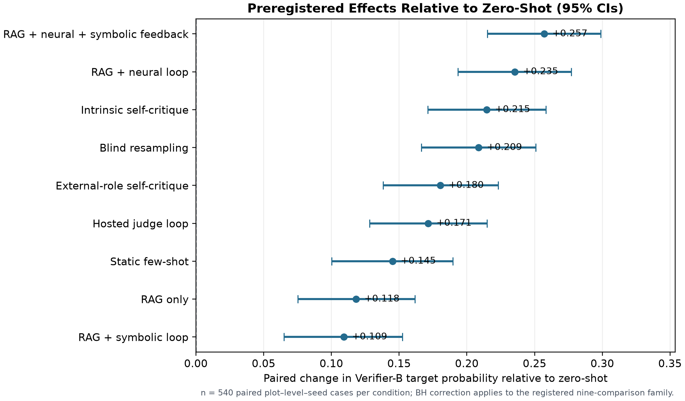
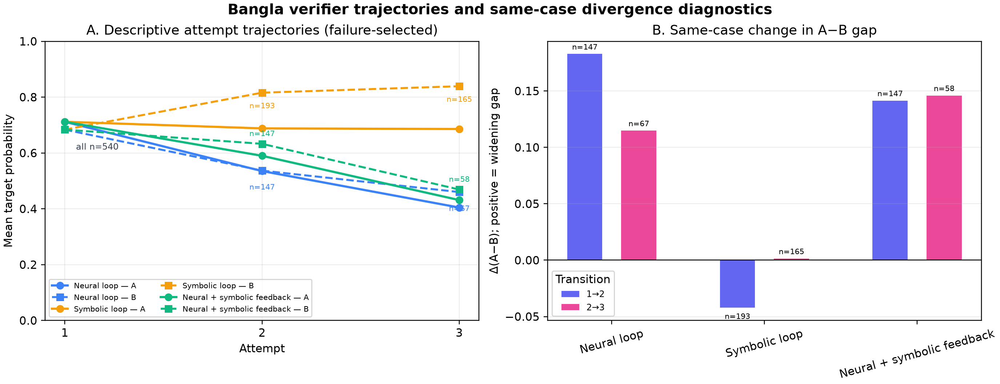
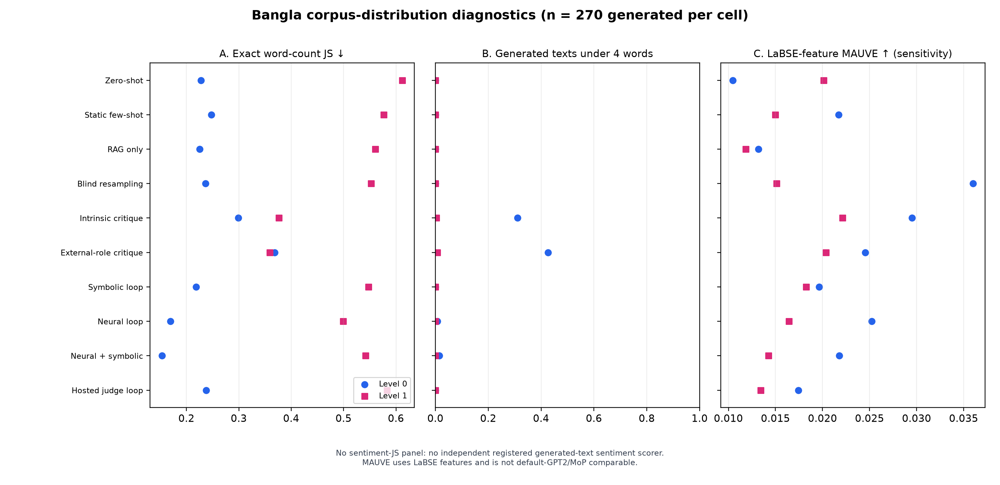

# Chapter 6 — Experimental Results and Analysis

This chapter reports the completed Bangla generation experiment. It fixes the
experimental units, the outcome measures and the inferential family before any
quality number appears, and it verifies the integrity of the archive on which
every number depends before interpreting any of them. Automatic outcomes,
loop-internal verifier divergence, blinded human judgment, distributional
diagnostics and rule-selected example outputs are then reported in separate
sections, because they answer different questions and do not carry equal
evidential weight. Values are quoted from the audited Phase-5 artifacts;
rounding in the tables is presentational and introduces no new analysis.

## 6.1 Experimental Design and Inferential Framework

The experiment tests whether progressively stronger generation controls make
short Bangla cinema responses conform more reliably to a requested
engagement-specificity level. Level 0 denotes a general or formulaic reaction;
Level 1 engages with a specific aspect, event, or construction element of the
film. What is under test is therefore **axis-level controllability** — whether a
requested level can be hit on demand — and not the prediction of how a
particular viewer or a real audience would react to a particular film. The
distinction is not rhetorical. The review corpus carries no film identifier
(Section 3.3), so no generated response can be compared against what any
audience actually wrote about the film whose synopsis produced it, and no result
in this chapter should be read as evidence that it could.

The evaluation surface contains 90 held-out plot synopses, two requested levels,
ten conditions and three generation replicates (seeds 42, 43 and 44), giving
5,400 condition-cases. Each condition contributes 540 cases, 270 at each level.
The replicates are paired blocking and sensitivity factors: they are not treated
as three independent studies, no best seed is selected, and no result is reported
for a single seed except where a rule-selected illustration is explicitly labelled
as such in Section 6.9. The execution contract that produced the surface — the
frozen Writer, its quantization and decoding parameters, seed handling, and the
ingestion gates applied before any model loaded — is specified in Section 5.7
and is not restated here.

The ten conditions and their intervention contracts are defined in Table 5.6.
This chapter uses them in four groups: one unconditioned baseline (zero-shot);
two example-conditioned single-pass conditions (static few-shot and RAG-only);
three gated loops (a neural gate, a symbolic gate, and a neural gate with
symbolic diagnostic feedback); and four controls (intrinsic self-critique,
external-role self-critique, a hosted Gemma-4 judge loop, and blind resampling
with Verifier-A selection). Retrieval draws only on the frozen R1 index.
Verifier-A is permitted inside the registered loops and in the blind-resampling
selector; Verifier-B is sealed from generation and used only for outcome
scoring. That separation is what makes the Goodhart diagnostic of Section 6.5
interpretable rather than circular.

For a generated response $y$ and a requested level $l$, the primary outcome is
the Verifier-B target probability $p_B(l \mid y)$, with binary target match
taken at its registered 0.5 decision point. Accounted logical generation calls
and tokens, the gave-up rate, lexical diversity, length and feature-space
realism, and blinded human target match provide complementary evidence on
questions the primary outcome does not answer.

The primary statistical family contains exactly nine paired comparisons, each
active condition against zero-shot. Cases are paired by plot, requested level and
generation seed. Uncertainty for the continuous outcome is estimated with 10,000
paired bootstrap resamples, following paired significance-testing guidance for
NLP [@b49]; binary target match is checked with McNemar's test; and the
nine-comparison family is corrected with the Benjamini–Hochberg procedure [@b50].
Three things this family deliberately does not authorize. It does not authorize a
ranking among the nine active conditions, because no active-versus-active
contrast was registered. It does not authorize selecting a best seed. And it does
not authorize promoting a comparison chosen after the results were seen into the
confirmatory family.

Two analyses outside this family are reported with their exploratory standing
made explicit. Section 6.4 reports a contrast between
neural-plus-symbolic feedback and the neural-only loop, and Section 6.6 reports a
same-item comparison between Verifier-B and the blinded human panel. Both were
specified and run after the registered results were known; both are labelled
exploratory at the point of use; their p-values are unadjusted and
post-selection; and neither revises a registered number. Verifier-B on all 5,400
cases remains the primary outcome throughout.

The scope of the experiment and all claims in this chapter is Bangla response
generation.

## 6.2 Run Integrity

The final archive contains exactly 5,400 unique registered case keys. There are
no missing, extra, or duplicate cases, and all 5,400 outputs received a separate
Verifier-B score. The scored-case source hash matches the sealed generation
manifest. The run used 7,068 local generation calls and 654 hosted judge calls;
the active archive contains no unresolved transport failure. Verifier-B is
absent from every generation record. These checks establish completeness and
isolation, not model quality.

Every analysis in this chapter reads that archive and does not extend it. This
includes the two post-hoc analyses and the example selection of Section 6.9: each
records the SHA-256 digests of the case archive
(`816a631b…`) and of the Verifier-B score file (`0a7de4b6…`), and each records
that it performed no generation rerun and no rescoring. A reader can therefore
check that the exploratory sections and the registered sections are reading the
same bytes, which is the property that makes an exploratory addition auditable
rather than merely disclosed.

## 6.3 Comparative Results Across Experimental Conditions

Table 6.1 reports the complete 20-cell Bangla result. Mean target probability
and binary accuracy are both computed by Verifier-B. Accounted call and token counts
include all same-model Writer, Reflector and critique calls charged to a
condition; token totals include prompt and completion tokens. They should be
read together with outcome quality rather than as independent quality metrics.

**Table 6.1. Verifier-B outcomes and accounted local-generation cost**

**Panel A. Verifier-B outcomes**

| Condition | Level | n | Mean target probability | Binary accuracy |
|---|---:|---:|---:|---:|
| Zero-shot | 0 | 270 | 0.3513 | 0.3296 |
| Zero-shot | 1 | 270 | 0.7794 | 0.8074 |
| Static few-shot | 0 | 270 | 0.6109 | 0.6037 |
| Static few-shot | 1 | 270 | 0.8100 | 0.8407 |
| RAG-only | 0 | 270 | 0.5314 | 0.5185 |
| RAG-only | 1 | 270 | 0.8358 | 0.8704 |
| RAG + neural loop | 0 | 270 | 0.6890 | 0.6889 |
| RAG + neural loop | 1 | 270 | 0.9124 | 0.9630 |
| RAG + symbolic loop | 0 | 270 | 0.5314 | 0.5185 |
| RAG + symbolic loop | 1 | 270 | 0.8176 | 0.8519 |
| RAG + neural + symbolic feedback | 0 | 270 | 0.7323 | 0.7333 |
| RAG + neural + symbolic feedback | 1 | 270 | 0.9123 | 0.9593 |
| Intrinsic self-critique | 0 | 270 | 0.6791 | 0.6815 |
| Intrinsic self-critique | 1 | 270 | 0.8809 | 0.9222 |
| External-role self-critique | 0 | 270 | 0.6109 | 0.6111 |
| External-role self-critique | 1 | 270 | 0.8806 | 0.9222 |
| Gemma-4 judge loop | 0 | 270 | 0.6286 | 0.6296 |
| Gemma-4 judge loop | 1 | 270 | 0.8450 | 0.8815 |
| Blind resampling | 0 | 270 | 0.6485 | 0.6444 |
| Blind resampling | 1 | 270 | 0.8995 | 0.9407 |

**Panel B. Accounted local-generation cost and termination**

| Condition | Level | Mean model calls | Mean total tokens | Exhausted rate |
|---|---:|---:|---:|---:|
| Zero-shot | 0 | 1.000 | 590.3 | 0.0000 |
| Zero-shot | 1 | 1.000 | 601.4 | 0.0000 |
| Static few-shot | 0 | 1.000 | 823.0 | 0.0000 |
| Static few-shot | 1 | 1.000 | 766.1 | 0.0000 |
| RAG-only | 0 | 1.000 | 955.1 | 0.0000 |
| RAG-only | 1 | 1.000 | 840.8 | 0.0000 |
| RAG + neural loop | 0 | 1.904 | 1511.5 | 0.0926 |
| RAG + neural loop | 1 | 1.681 | 1231.2 | 0.0556 |
| RAG + symbolic loop | 0 | 1.022 | 969.3 | 0.0000 |
| RAG + symbolic loop | 1 | 3.630 | 2409.4 | 0.5333 |
| RAG + neural + symbolic feedback | 0 | 1.889 | 1510.3 | 0.0630 |
| RAG + neural + symbolic feedback | 1 | 1.630 | 1215.3 | 0.0593 |
| Intrinsic self-critique | 0 | 3.000 | 3086.7 | 0.0000 |
| Intrinsic self-critique | 1 | 3.000 | 2757.8 | 0.0000 |
| External-role self-critique | 0 | 3.000 | 3085.4 | 0.0000 |
| External-role self-critique | 1 | 3.000 | 2757.6 | 0.0000 |
| Gemma-4 judge loop | 0 | 1.389 | 1339.2 | 0.0111 |
| Gemma-4 judge loop | 1 | 1.033 | 869.2 | 0.0000 |
| Blind resampling | 0 | 1.456 | 1385.5 | 0.0000 |
| Blind resampling | 1 | 1.326 | 1115.3 | 0.0000 |

*Note.* Mean total tokens include prompt and completion tokens from every local
Writer, Reflector and critique call charged to the condition. Hosted-judge calls
and tokens are excluded from both cost columns and reported separately in the
run audit. For blind resampling, the columns report only the budget-admitted
candidate prefix; all five candidates were physically generated once to form
the frozen nested frontier. The exhausted rate applies only to conditions with
a bounded acceptance loop.

The table contains a strong level asymmetry. Every condition performs better at
Level 1 than Level 0 in binary accuracy. For example, zero-shot reaches 0.8074
at Level 1 but only 0.3296 at Level 0. The neural-plus-symbolic condition narrows
this weakness substantially, reaching 0.9593 and 0.7333 respectively, but does
not remove it. Consequently, a pooled score alone would hide an important part
of the system's behaviour.

The symbolic-only loop matches RAG-only at Level 0 (accuracy 0.5185), while its
Level-1 accuracy declines from 0.8704 to 0.8519 and it exhausts the attempt
budget on 53.33% of Level-1 cases. Symbolic diagnostics attached to the neural
gate produce the highest descriptive Level-0 target probability and accuracy in
Table 6.1. Because the registered family contains no neural-only versus
neural-plus-symbolic contrast, this table does not establish that symbolic
feedback caused the difference. Section 6.9 illustrates the mechanism behind the
symbolic loop's cost: because its best-of-three fallback is selected on the
*gate* score, a draft that both verifiers scored highly can be discarded in
favour of one that neither accepts.

Self-critique is also expensive. Both intrinsic and external-role conditions use
three generation calls per case on average, whereas the neural-plus-symbolic
loop uses 1.889 calls at Level 0 and 1.630 at Level 1. Intrinsic critique exceeds
external-role critique at Level 0 but is nearly identical at Level 1. Because
the registered inferential family compares each row only with zero-shot, these
descriptive differences must not be presented as tested pairwise superiority.

### 6.3.1 Level-Wise Outcome Pattern

The largest pattern in Table 6.1 is the lower automatic performance at Level 0.
Three additional measurements characterize a plausible measurement contribution
to this asymmetry without treating it as an established cause.

**In the corpus the two levels sit on the opposite side of length from the naive
reading.** The region-A cut that defines the axis is length-entangled: length AUC
is 0.6764, which fires the registered `LENGTH_CONFOUNDED` label, and a rule using
nothing but word count reaches 0.6197 macro-F1 against a majority floor of
0.3926 (Sections 3.6 and 4.4). Crucially, it is **Level 0 that is the longer
half** — 13.12 mean words against Level 1's 8.85 — while Level 1 draws more
distinct word types at an equal token budget. A verifier trained on this corpus
therefore has a length regularity available to it, and that regularity points
*longer* for Level 0.

**In generated text the polarity inverts.** Under the uniform 20-word prompt
ceiling of Section 5.3.2, the registered development-plot diagnostic records mean
lengths of 11.47 words at Level 0 against 16.23 at Level 1, a level gap of
−4.77 words where the corpus gap is +4.27. In the same file, a word count alone
recovers the requested level at AUC 0.9111 under length control, and the verdict
`LENGTH_RECOVERS_LEVEL` is registered. Two disclosures belong with this figure:
the file is flagged `NOT_A_RESULT`, and it covers 30 development plots at attempt
one with no Critic in the loop, so it establishes the direction of the inversion
and not its magnitude on the evaluation surface. Recent work on decoupling length
from specificity in description evaluation is the reason this cannot be waved
away as a nuisance parameter: length and specificity are entangled in the
construct, not only in the estimator [@b81].

**On identical items, the human panel has the same observed accuracy at both
levels, whereas the automatic instrument has a large observed gap.** Section
6.6 reports the comparison in full. On
the 100 blinded items, the human majority label matches the requested level for
0.92 of items at Level 0 and 0.92 at Level 1, while Verifier-B matches 0.60 at
Level 0 and 0.90 at Level 1.

Taken together, these suggest that part of the measured Level-0 weakness is a
property of the measuring instrument rather than of the generated text. The
verifiers were fitted where longer meant Level 0, and they are applied where
longer means Level 1, so they are asked to score exactly the region in which
their most available surface cue points the wrong way. Under this hypothesis the
Level-0 column of Table 6.1 understates how often a reader would accept the
output.

Two things prevent that from being asserted. The length-matched slice of Section
6.7 still shows a Level-0 deficit within pairs of similar length — zero-shot
reaches 0.4667 at Level 0 against 0.8000 at Level 1 — which is what the
hypothesis would least like to see, although the slice conditions on a
post-treatment variable and cannot settle the question either way. And 50 items
per level under a forced binary choice bounds the human comparison rather than
resolving it [@b36]. The hypothesis is therefore retained as one plausible
account consistent with the registered evidence, not as an identified cause,
and the registered numbers are left exactly as they stand.

## 6.4 Preregistered Paired Comparisons and Exploratory Direct Contrast

All nine preregistered condition-versus-zero-shot comparisons have positive
Verifier-B target-probability effects. Under the registered paired-testing
design [@b49], every 95% paired-bootstrap interval excludes zero. The largest effect belongs
to neural gating with symbolic diagnostic feedback: +0.2570 (95% CI
[+0.2151, +0.2987]). The neural-only loop follows at +0.2354
[+0.1934, +0.2772]. Intrinsic self-critique, blind resampling, and external-role
self-critique yield +0.2147, +0.2087, and +0.1804 respectively. The hosted
Gemma-4 judge loop yields +0.1715, static few-shot +0.1451, RAG-only +0.1182,
and the symbolic-only loop +0.1091. For all nine comparisons the paired bootstrap
p-value and the Benjamini–Hochberg [@b50] q-value are both $2/10001 \approx
2.0\times10^{-4}$, and the corresponding McNemar tests are also significant.

That shared value is the two-sided resolution floor of 10,000 resamples — the
smallest p-value the procedure can return — and not evidence that all nine
effects have equal strength. Reporting it as a fraction rather than as nine
identical decimals is deliberate: the denominator shows why the values coincide.
Effect sizes, confidence intervals and discordant-pair counts, rather than
differences among floor-valued p-values, carry the comparative information.

No standardised effect size was registered for this family, so none is
introduced here; Table 6.2 reports the discordant pair counts underlying each
McNemar test instead, which is the quantity the registered binary test actually
uses and which shows how one-sided each condition's disagreement with the
baseline is.

**Table 6.2. Paired condition comparisons: preregistered baseline family and exploratory direct contrast**

**Panel A. Continuous Verifier-B outcome**

| Condition | n pairs | Δ target probability | 95% paired-bootstrap CI | Bootstrap p = BH q |
|---|---:|---:|---:|---:|
| Static few-shot | 540 | +0.1451 | [0.1001, 0.1897] | 2/10001 |
| RAG-only | 540 | +0.1182 | [0.0753, 0.1618] | 2/10001 |
| RAG + neural loop | 540 | +0.2354 | [0.1934, 0.2772] | 2/10001 |
| RAG + symbolic loop | 540 | +0.1091 | [0.0649, 0.1524] | 2/10001 |
| RAG + neural + symbolic feedback | 540 | +0.2570 | [0.2151, 0.2987] | 2/10001 |
| Intrinsic self-critique | 540 | +0.2147 | [0.1711, 0.2584] | 2/10001 |
| External-role self-critique | 540 | +0.1804 | [0.1381, 0.2231] | 2/10001 |
| Gemma-4 judge loop | 540 | +0.1715 | [0.1282, 0.2149] | 2/10001 |
| Blind resampling | 540 | +0.2087 | [0.1664, 0.2510] | 2/10001 |

**Panel B. Binary Verifier-B target match**

| Condition | Condition-only success | Zero-shot-only success | Exact McNemar p |
|---|---:|---:|---:|
| Static few-shot | 137 | 54 | 1.66×10⁻⁹ |
| RAG-only | 122 | 54 | 3.18×10⁻⁷ |
| RAG + neural loop | 167 | 28 | 2.70×10⁻²⁵ |
| RAG + symbolic loop | 121 | 58 | 2.86×10⁻⁶ |
| RAG + neural + symbolic feedback | 176 | 26 | 1.46×10⁻²⁸ |
| Intrinsic self-critique | 160 | 34 | 9.62×10⁻²¹ |
| External-role self-critique | 146 | 39 | 9.51×10⁻¹⁶ |
| Gemma-4 judge loop | 147 | 46 | 1.66×10⁻¹³ |
| Blind resampling | 154 | 33 | 6.91×10⁻²⁰ |

Values are rounded from `s5_main_bn_paired_statistics.csv`; the registered
family contains no active-condition-versus-active-condition contrast. A
discordant pair is one in which exactly one of the two conditions produced a
Verifier-B target match on the same plot, level and seed; the two columns are the
counts entering each McNemar test. Every condition wins more discordant pairs
than it loses, and the two neural-gated loops are the most one-sided, at 167
against 28 and 176 against 26.

**Panel C. Exploratory neural-plus-symbolic minus neural-only contrast**

| Outcome or cost measure | Paired estimate | Uncertainty or paired test | Evidential standing |
|---|---:|---|---|
| Verifier-B target probability | +0.02159 | Naive post-selection 95% CI [0.00082, 0.04310] | Concentrated at Level 0; exploratory |
| Binary target accuracy | +0.02037 | 26 versus 15 discordant successes; exact McNemar *p*=0.11728 | Not statistically significant |
| Generator calls | −0.033 | Descriptive paired mean | Exploratory cost difference |
| Generator tokens | −8.54 | Descriptive paired mean | Exploratory cost difference |

Panel C uses the same 540 frozen plot–level–seed pairs but lies outside the
registered nine-comparison family. Its interval and test are unadjusted and
post-selection; the panel does not establish hybrid superiority.

*Figure 6.1. Preregistered paired changes in Verifier-B target probability
relative to zero-shot. Points show mean paired differences and whiskers show
95% paired-bootstrap confidence intervals over 540 plot–level–seed pairs per
condition. The figure summarizes the registered condition-versus-zero-shot
family; it does not provide confirmatory active-condition rankings.*

These comparisons answer the broad RQ2 question: every registered augmentation
improves Verifier-B target probability over zero-shot on this Bangla surface.
To address RQ3 directly, an exploratory paired comparison was conducted between
neural-plus-symbolic feedback and the neural-only loop using the 540 frozen
plot–level–seed pairs. The hybrid condition increases Verifier-B target
probability by 0.02159 and binary target accuracy by 0.02037. The binary
difference is not statistically significant (26 versus 15 discordant
successes; exact McNemar p=0.11728). The probability difference is concentrated
at Level 0 (+0.04328), whereas the Level-1 difference is approximately zero
(-0.00009). The contrast was added after the registered results were known and
after the hybrid condition had been observed to have the largest zero-shot
effect, so it sits outside the confirmatory family, its p-value is unadjusted and
post-selection, and its confidence interval is a naive post-selection interval.
The observed probability pattern is level-specific, but the analysis does not
establish either a level-specific causal advantage or overall hybrid
superiority.

## 6.5 Verifier-in-the-Loop Dynamics and Proxy Divergence

*Figure 6.2. Attempt dynamics and the A-minus-B verifier-divergence diagnostic.
The first
panel shows attempt-wise Verifier-A and Verifier-B means, whose later attempts
are failure-selected by construction and therefore cannot be read as a learning
curve. The second panel reports same-case adjacent changes in the A-minus-B gap,
which is the interpretable diagnostic.*

For the neural loop, the paired A–B gap widens by 0.182802 from attempt 1 to 2
(n=147 continuing cases) and by 0.114836 from attempt 2 to 3 (n=67). For the
neural-plus-symbolic loop, the widening is 0.141481 (n=147) and 0.145979 (n=58).
The symbolic-only loop differs: its gap changes by -0.042224 (n=193) and
+0.001396 (n=165). Thus optimization against Verifier-A is associated with
increasing A–B divergence in the two neural-gated loops, but not in the same
form under the symbolic-only gate.

This is evidence of **measurable verifier divergence**, not proof that every
revision is reward hacking. Later-attempt populations contain only previous
failures, and Verifier-B's own calibration improvement was not established.
Recent evaluator-stress-test work likewise treats proxy–true divergence and
controlled perturbations as diagnostics rather than assuming the optimized
evaluator remains valid [@b7]. The sealed outcome-scorer wall therefore
makes the failure visible; it does not make Verifier-B an infallible oracle.

## 6.6 Blinded Human Validation of Requested Level

Three adult native-Bangla annotators independently rated the same frozen,
balanced 100-item subset under blinded condition labels. The subset contains
five items from each of the 20 condition-by-level cells. It was sampled without
using Verifier-A or Verifier-B scores, avoiding evaluator-conditioned item
selection [@b33], and persistent rater codes support repeated-rating and
annotator-variation analysis [@b34; @b35]. All 300 registered
judgments passed the ingestion gate. Pooled target-match accuracy is 0.9133
(item-bootstrap 95% CI [0.8667, 0.9567]). Annotator accuracies are 0.91, 0.93,
and 0.90. Raw three-way agreement is 0.88, and nominal Krippendorff alpha [@b31]
is 0.8405 (item-bootstrap 95% CI [0.7473, 0.9200]). The interval and disagreement
pattern are retained because agreement coefficients should not be reduced to a
universal cutoff [@b37].

**Table 6.3. Blinded human validation of requested level**

| Scope | n items | n judgments | Accuracy | 95% item-bootstrap CI |
|---|---:|---:|---:|---:|
| Annotator A | 100 | 100 | 0.9100 | [0.8500, 0.9600] |
| Annotator B | 100 | 100 | 0.9300 | [0.8800, 0.9800] |
| Annotator C | 100 | 100 | 0.9000 | [0.8400, 0.9500] |
| Pooled judgments | 100 | 300 | 0.9133 | [0.8667, 0.9567] |

**Panel B. Panel-level agreement**

| Agreement measure | Estimate | 95% item-bootstrap CI | Interpretation |
|---|---:|---:|---|
| Raw three-way agreement | 0.8800 | Not estimated | All three annotators selected the same level on 88 of 100 items |
| Nominal Krippendorff alpha | 0.8405 | [0.7473, 0.9200] | Agreement beyond chance under the registered nominal coefficient |

Across items, raw three-way agreement is 0.8800 and nominal Krippendorff
alpha is 0.8405 with 95% item-bootstrap CI [0.7473, 0.9200]. Both target levels
have identical pooled accuracy: 137/150, or 0.9133.

Level balance is exact: both levels receive 137 correct judgments out of 150.
Among the 50 items per level, five Level-0 and seven Level-1 items split 2-to-1;
the remainder are unanimous. The observed result is therefore not concentrated
in one requested level or one annotator.

The human study validates a narrower claim than the automatic table. Readers
can usually recover the requested engagement-specificity level from outputs on
the balanced subset. It does not validate each condition separately: every
condition × level cell contains only five items and 15 judgments. It also does
not measure overall writing quality, factual faithfulness to the plot, viewer
preference, or predictive audience behaviour.

### 6.6.1 Same-Item Instrument Comparison

Because the human panel scored a subset of the frozen outputs, two distinct
instruments answered the same question about the same 100 texts, and their
agreement can be measured rather than assumed. Table 6.4 reports that comparison.
It is exploratory: it was specified after the registered results were known, in
order to test the hypothesis of Section 6.3, its p-values are unadjusted and
post-selection, and it is not part of the confirmatory family. Verifier-B on all
5,400 cases remains the primary outcome, and nothing in this subsection revises
a registered number.

One aggregation detail matters for reading the table. Table 6.3 reports 0.9133
because it pools 300 judgments; a same-item comparison needs one human label per
item, so Table 6.4 applies the registered majority-of-three rule, which yields
0.92. The two figures are the same data under two aggregations, and neither
supersedes the other. Verifier-A is shown alongside Verifier-B at the operating
point it actually used inside the loop, and is reported as a secondary instrument
only; no claim is made that either verifier is better than the other.

**Table 6.4. Same-item comparison of the level-measuring instruments, 100 blinded items**

**Panel A. Target-match accuracy and raw agreement**

| Stratum | n items | Human majority accuracy | Verifier-B accuracy | Verifier-A accuracy | Human–B raw agreement |
|---|---:|---:|---:|---:|---:|
| Level 0 | 50 | 0.92 | 0.60 | 0.70 | 0.60 |
| Level 1 | 50 | 0.92 | 0.90 | 0.84 | 0.86 |
| Pooled | 100 | 0.92 | 0.75 | 0.77 | 0.73 |

**Panel B. Paired human-majority and Verifier-B disagreements**

| Stratum | Human-only correct | Verifier-B-only correct | Exact McNemar p |
|---|---:|---:|---:|
| Level 0 | 18 | 2 | 0.000402 |
| Level 1 | 4 | 3 | 1.0 |
| Pooled | 22 | 5 | 0.001514 |

The pattern is consistent with the hypothesis in Section 6.3. The human panel
has the same observed accuracy at both levels, 0.92 and 0.92. Both automatic
instruments are markedly worse at Level 0 than at Level 1 —
Verifier-B at 0.60 against 0.90, Verifier-A at 0.70 against 0.84 — so the level
asymmetry of Table 6.1 is observed in the instruments but not in the human
majority labels on these items. The disagreement is also strongly directional at
Level 0: on 18 items the
panel recovered the requested level and Verifier-B did not, against 2 in the
opposite direction, while at Level 1 the counts are 4 and 3 and the paired test is
does not detect a directional difference.

Chance-corrected agreement is reported for completeness and should not be
compared across the two strata. Cohen's kappa is 0.46 pooled, 0.038 at Level 0
and 0.146 at Level 1, and the arithmetic reason for that ordering is visible in
the table rather than substantive: within a level stratum the requested level is
constant, so both instruments' label marginals are skewed toward it, expected
agreement is high, and the coefficient is small even where raw agreement is 0.86.
Pooling the two strata balances the marginals and raises the coefficient. Raw
agreement — 0.60 at Level 0 against 0.86 at Level 1 — is the readable figure
here, which is precisely why a coefficient is not treated as a verdict [@b37].

Three limits fix what this comparison can support. It does not establish which
instrument is closer to the construct: the corpus-derived cut that trained the
verifiers and the axis definition the annotators applied are operationalizations
of the same construct, not the same measurement, and the frozen data cannot
adjudicate between them. It is refused at condition level, because five items and
15 judgments per condition-by-level cell cannot support it, and the human study
already declined to interpret cells separately. And with 50 items per level it
bounds the disagreement rather than estimating it precisely [@b36]. What it does
support is a caution that carries into Chapter 7: an automatic outcome measure
that is 0.32 below blinded readers in one stratum and 0.02 below them in the
other is not equally trustworthy across the two halves of its own axis.

## 6.7 Length-Matched Sensitivity Analysis

The preregistered sensitivity slice pairs Level-0 and Level-1 outputs from the
same plot, condition, and replicate when their word counts differ by less than
15% of the larger count. It retains 486 of 2,700 possible pairs. Coverage is
strongly condition-dependent: only 9/270 pairs (3.33%) survive for external-role
self-critique and 11/270 (4.07%) for intrinsic self-critique, compared with
80/270 (29.63%) for blind resampling; other conditions retain 30–70 pairs.

The slice cannot be used as a new ranking. Conditioning on generated length is
post-treatment selection, and conditions change length differently. Apparent
matched accuracies of 0.944 and 0.955 for external-role and intrinsic critique
rest on only 9 and 11 pairs. The full 5,400-case analysis remains primary, and
no claim of length-neutral axis control is made.

**Table 6.5. Length-matched post-treatment sensitivity slice**

| Condition | Matched pairs / 270 | Coverage | Mean absolute word gap | Accuracy all | L0 | L1 |
|---|---:|---:|---:|---:|---:|---:|
| Zero-shot | 30 | 11.11% | 1.267 | 0.6333 | 0.4667 | 0.8000 |
| Static few-shot | 40 | 14.81% | 1.100 | 0.7625 | 0.7250 | 0.8000 |
| RAG-only | 70 | 25.93% | 1.157 | 0.7500 | 0.5857 | 0.9143 |
| RAG + neural loop | 64 | 23.70% | 1.156 | 0.8359 | 0.7031 | 0.9688 |
| RAG + symbolic loop | 67 | 24.81% | 1.224 | 0.7537 | 0.6119 | 0.8955 |
| RAG + neural + symbolic feedback | 57 | 21.11% | 1.105 | 0.8684 | 0.7544 | 0.9825 |
| Intrinsic self-critique | 11 | 4.07% | 0.818 | 0.9545 | 1.0000 | 0.9091 |
| External-role self-critique | 9 | 3.33% | 1.111 | 0.9444 | 1.0000 | 0.8889 |
| Gemma-4 judge loop | 58 | 21.48% | 1.155 | 0.8448 | 0.7241 | 0.9655 |
| Blind resampling | 80 | 29.63% | 1.088 | 0.8188 | 0.6875 | 0.9500 |

The 486 retained pairs are selected after generation under a 15% relative
word-count tolerance. Coverage, rather than apparent accuracy alone, controls
the interpretation of this table.

The slice also bears on the hypothesis of Section 6.3, and it does not confirm
it. Within pairs of near-identical length the Level-0 column remains below the
Level-1 column for eight of ten conditions, with the two exceptions resting on
nine and eleven pairs. If the entire Level-0 deficit were an artifact of the
length inversion, matching on length should have removed most of it, and it does
not. What weakens the counter-argument in turn is the selection: retained pairs
are those the treatment happened to make similar in length, and the two
conditions with the largest apparent Level-0 recovery are the two with the least
coverage. The combined evidence is consistent with length contributing to the
deficit, but neither this post-treatment slice nor Table 6.4 identifies the
magnitude of that contribution.

## 6.8 Diversity and Corpus-Distribution Diagnostics

*Figure 6.3. Length-distribution, short-output and LaBSE-feature MAUVE
diagnostics across the 20 Bangla condition-level cells. The three panels are
kept separate because no composite realism score was preregistered, and none is
defined here.*

Exact word-count Jensen–Shannon (JS) divergence against the region-A reference
ranges from 0.153390 to 0.611987 across the 20 cells. The reference itself is
level-specific — 1,143 real Level-0 reviews and 754 real Level-1 reviews — and
the divergences are strongly asymmetric with respect to it: in nine of the ten
conditions the Level-1 cell is further from real Level-1 length than the Level-0
cell is from real Level-0 length, the exception being external-role self-critique
at 0.3687 against 0.3591. The lowest value in the table is
neural-plus-symbolic feedback at Level 0 (0.153390) and the highest is zero-shot
at Level 1 (0.611987). This is the corpus-side counterpart of the inversion
described in Section 6.3: real Level-1 reviews are the short ones, and generated
Level-1 responses are the long ones.

Short-output rates are not a general property of the low-specificity level, and
reporting the maximum alone would suggest that they were. The highest
under-four-word rate is external-role critique at Level 0, at 115/270 or 42.59%,
followed by intrinsic critique at Level 0, at 84/270 or 31.11%. Those two cells
account for almost all such outputs: in the remaining 18 cells the count is
between zero and four, including 2/270 for the neural loop at Level 0 and 4/270
for neural-plus-symbolic feedback at Level 0. Degenerate shortening is therefore
a behaviour of the two self-critique arms when a general reaction is requested,
not a consequence of requesting Level 0.

Lexical diversity is reported separately rather than folded into realism.
Across the 20 cells, Distinct-1 ranges from 0.210526 to 0.332641, Distinct-2
from 0.499618 to 0.728167, and Self-BLEU-4 from 0.137042 to 0.477088. The
lowest Self-BLEU-4 occurs for external-role self-critique at Level 1; the
highest occurs for zero-shot at Level 0. These ratios are length-sensitive
corpus diagnostics and do not constitute a quality ranking.

LaBSE-feature MAUVE ranges from 0.010463 to 0.035995 and is a small-sample
feature-space sensitivity analysis. Each cell contains 270 generated and 270
real texts, below the scale recommended for stable MAUVE estimation, and LaBSE
features are not directly comparable with default GPT-2/MoP MAUVE [@b55].
Sentiment JS remains unmeasured because no independent registered
generated-text sentiment scorer exists. The data also contain no
review-to-film mapping, so realism is assessed at corpus level rather than as
film-level audience prediction.

## 6.9 Qualitative Error Analysis

Aggregate tables state how often the outcome measure disagreed with the request;
they do not show what the disagreement looked like. This section shows six
outputs. They are selected by a registered rule rather than chosen after reading
the archive: the config fixes six strata in advance, restricts selection to
replicate seed 42, and takes the lexicographically first case key within each
stratum, so the choice is deterministic and independent of subjective example
quality. Each example is reported beside the size of the stratum it was drawn from,
out of the 90 evaluation plots at that condition and level, so its
representativeness travels with it. The examples are illustrative only and define
no new metric; because Verifier-B is the registered outcome measure and not
ground truth, a case it marks as failing is evidence about the measured outcome
and not proof that a reader would agree.

**Table 6.6. Rule-selected example outputs, replicate seed 42**

**Panel A. Selection metadata**

| ID | Condition | Level | Selection stratum | Stratum size / 90 |
|---|---|---:|---|---:|
| E1 | Zero-shot | 0 | Verifier-B failure | 53 |
| E2 | Zero-shot | 1 | Verifier-B failure | 19 |
| E3 | RAG + neural + symbolic feedback | 0 | Residual failure | 27 |
| E4 | RAG + neural + symbolic feedback | 1 | Residual failure | 3 |
| E5 | RAG + neural + symbolic feedback | 0 | Repaired pair, treatment | 36 |
| E5′ | Zero-shot | 0 | Repaired pair, baseline | — |
| E6 | RAG + symbolic loop | 1 | Failure after budget exhaustion | 6 |

**Panel B. Text and verifier measurements**

| ID | Words | Verifier-B target probability | Verifier-A target probability | Model calls |
|---|---:|---:|---:|---:|
| E1 | 7 | 0.1638 | 0.0012 | 1 |
| E2 | 20 | 0.4147 | 0.7117 | 1 |
| E3 | 14 | 0.4894 | 0.9925 | 1 |
| E4 | 15 | 0.0567 | 0.9850 | 1 |
| E5 | 14 | 0.9853 | 1.0000 | 1 |
| E5′ | 7 | 0.1638 | 0.0012 | 1 |
| E6 | 24 | 0.1173 | 0.0000015 | 5 |

Plot BN002 supplies three rows because the deterministic lexicographic rule
selects the lowest eligible case key; E5′ and E1 are the same baseline case.

**E1: baseline Level-0 failure (53/90).**

> ব্যাপারটা খুবই দুঃখজনক! এমন একটা গল্প! 😥😥

This seven-word exclamation contains an intensifier, repetition and emoji. Both
verifiers reject it ($p_B=0.1638$, $p_A=0.0012$), illustrating a measured
Level-0 failure under the two automatic instruments. The text alone does not
establish that a human reader would reject the requested level.

**E3: residual Level-0 failure (27/90).**

> ব্যাপারটা পুরাই অন্যরকম! শেষটা মনে হল যেন একটু বেশি প্যাঁচানো ছিল, তবে ছবিটা ভালোই।

The text mentions the ending and lies near Verifier-B's decision boundary
($p_B=0.4894$), while Verifier-A accepts it strongly ($p_A=0.9925$). It therefore
illustrates instrument divergence on a linguistically borderline response.

**E2 and E4: opposite automatic labels at Level 1.** E4 occurs in 3/90 cases in
its stratum:

> আশা মারা গেল এটা মেনে নিতে পারিনি, এমন একটা সুন্দর গল্পে এত বড় একটা ধাক্কা!

Verifier-A scores E4 at 0.9850 and Verifier-B at 0.0567. E2, selected from a
19/90 zero-shot failure stratum, shows the same directional disagreement:

> গল্পটা দেখাচ্ছিল, একটা মেয়ের জীবন এভাবে শেষ হয়ে যায়! মেনে নিতে পারলাম না, এত সুন্দর একটা প্রাণ এভাবে চলে গেল।

Here $p_A=0.7117$ exceeds its operating threshold while $p_B=0.4147$ remains
below 0.5. The two examples instantiate the opposite-label disagreements
quantified in Section 6.6; E2 also reaches the 20-word prompt ceiling.

**E5/E5′: paired Level-0 change (36/90).**

> অসাধারণ! গল্পটা খুবই হৃদয়স্পর্শী, এমন একটা ছবি দেখে মনটা একেবারে খাঁ খাঁ করে উঠলো।

For the same plot, level and seed, Verifier-B increases from 0.1638 to 0.9853,
while length increases from seven to fourteen words. The pair illustrates both
the measured condition effect and its length entanglement.

**E6: symbolic-gate budget exhaustion (6/90 outcome failures).**

> ছবিটা দেখেই বোঝা যাচ্ছে মাল কাহিনীর চেয়ে বেশি কিছু না। নায়কের অ্যাকশনগুলো একটু বেশিই ভেলান্টিয়ার লাগছে, আর ফুল আর ধনী বাবুর প্রেম—এটা আগে দেখিনি!

Across its three drafts, $p_B$ is 0.9414, 0.1173 and 0.7380, whereas $p_A$ is
0.9952, 0.0000015 and 0.9801. Under the symbolic-gate fallback, the controller
emits the second draft even though both trained verifiers score the first more
highly. At seed 42, 50/90 Level-1 cases
in this condition exhaust the budget and 6/90 also fail Verifier-B. This example
demonstrates the fallback mechanism; it does not imply that every exhausted case
fails the outcome measure.

## 6.10 Baseline Scope and External Comparability

The experiment uses nine internal comparators against zero-shot: static
few-shot, RAG-only, three gated-loop variants, two self-critique variants, a
hosted same-family judge loop and blind resampling. These conditions share the
same target definition, Writer contract and frozen evaluation cases, allowing
paired estimation of their effects relative to zero-shot. Blind resampling is
matched through the same-case model-token budget admitted to its primary
candidate prefix. This controls an important component of accounted inference
expenditure, but all five candidates were generated to construct the nested
frontier, and the match is not equivalent to physical-run cost, hardware-FLOPs,
or latency matching.

No published system is evaluated as an external baseline. The literature review
in Chapter 2 identified no directly comparable Bangla system with the same
engagement-specificity target and sealed outcome-verifier contract. This is a
bounded statement about that narrative review, not a claim that no related
system exists. In addition, the review corpus has no film identifier, so the
study cannot construct film-matched reference responses for conventional
reference-based evaluation. A future external comparison would require the same
Bangla task definition, plot set, 20-word instruction, generation budget and
outcome-scoring contract; it would constitute a new analysis rather than a
reinterpretation of the present results.

## 6.11 Answers to the Research Questions

- **RQ1:** Answered in Chapter 3, not here. The verdict is qualified support: a
  reproducible region-A cut is human-recognizable as engagement specificity under
  length-matched comparative judgment, but it is a continuum cut rather than a
  discovered audience segment and does not replicate structurally in region B
  (Section 3.12). That verdict is a premise of this chapter rather than one of
  its results, and it is also the origin of the length entanglement that
  Sections 6.3, 6.7 and 6.8 keep in view.
- **RQ2:** Supported within the completed Bangla arm. Every registered active
  condition improves Verifier-B target probability over zero-shot, and blinded
  human evaluation shows high overall recoverability of the requested level.
  The claim is controllability, not audience prediction.
- **RQ3:** The two symbolic roles are differentiated. Symbolic-only acceptance
  gating is weak and costly, while symbolic diagnostics combined with a neural
  gate produce the largest registered effect over zero-shot. In an explicitly post-hoc comparison over
  540 frozen pairs, hybrid minus neural-only is +0.02159 in Verifier-B target
  probability but only +0.02037 in binary accuracy (exact McNemar p=0.11728).
  The probability difference occurs at Level 0 (+0.04328), while Level 1 is
  null (-0.00009). Because the contrast was selected after inspecting the
  registered results, it is exploratory and does not establish hybrid
  superiority.
- **RQ4:** Supported as a diagnostic finding. Same-case A–B gaps widen across
  neural-loop revisions, consistent with overoptimization against the in-loop
  verifier. The result is bounded by failure selection and Verifier-B's
  calibration null.

## 6.12 Chapter Summary

All nine registered condition-versus-zero-shot comparisons show positive
Verifier-B target-probability differences on the frozen Bangla surface, with
paired-bootstrap intervals excluding zero after correction of the registered
family. These comparisons do not rank the active conditions. Blinded native
Bangla readers recover the requested level with 0.9133 pooled accuracy on the
balanced 100-item subset, supporting human recognizability of the controlled
level without establishing per-condition human performance.

The evidence is qualified in three ways. Automatic performance is consistently
lower at Level 0, while the exploratory same-item comparison shows a substantially
larger human–Verifier-B disagreement in that stratum. Generated length remains
associated with requested level in the opposite direction from the source
corpus, and the post-treatment length-matched slice cannot establish
length-neutral control. Finally, same-case revision diagnostics show widening
Verifier-A–Verifier-B gaps in the two neural-gated loops; this demonstrates
observable proxy divergence but does not prove that every revision constitutes
reward hacking. The direct neural-plus-symbolic versus neural-only contrast and
the same-item instrument comparison remain explicitly exploratory and outside
the registered confirmatory family.
