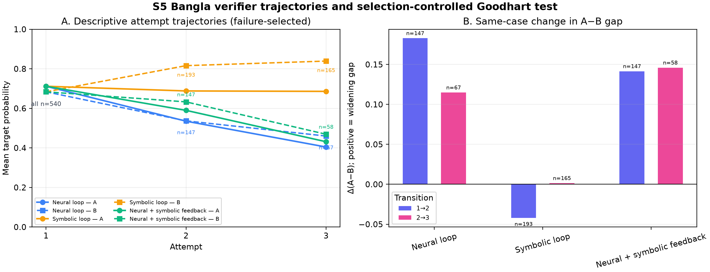
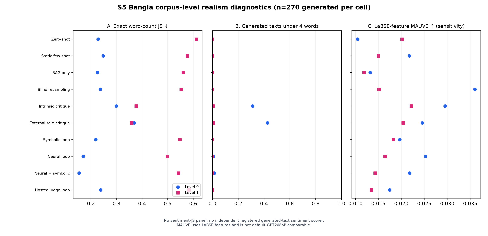

# Chapter 6 — Experimental Setup, Results, and Analysis

This chapter evaluates the proposed framework and nine registered alternatives
on the frozen Bangla generation surface. It first defines the experimental
units, outcomes, and inferential family, then verifies archive completeness
before presenting any quality result. Automatic outcomes, transition-level
verifier divergence, blinded human judgments, and distributional diagnostics
are reported separately because they answer different questions. Exact values
come from the audited Phase-5 artifacts; table rounding is presentational and
does not represent a new analysis.

## 6.1 Experimental design, outcomes, and scope

This chapter evaluates whether progressively stronger generation controls make
short Bangla cinema responses conform more reliably to a requested
engagement-specificity level. Level 0 denotes a general or formulaic reaction;
Level 1 engages with a specific aspect, event, or construction element of the
film. The experiment therefore tests **axis-level controllability**, not the
prediction of how a particular viewer or real audience would react.

The Bangla evaluation surface contains 90 held-out plot synopses, two requested
levels, ten conditions, and three preregistered generation replicates (seeds 42,
43, and 44), yielding 5,400 condition-cases. Each condition contributes 540
cases, with 270 at each level. Seeds are paired blocking and sensitivity factors;
they are not treated as three independent studies and no best seed is selected.

The ten conditions are: zero-shot, static few-shot, RAG-only, RAG with a neural
gate, RAG with a symbolic gate, RAG with a neural gate and symbolic diagnostic
feedback, intrinsic self-critique, external-role self-critique, a hosted Gemma-4
judge loop, and blind resampling with Verifier-A selection. Retrieval uses only
the frozen R1 index. Verifier-A is allowed inside the registered loop and in the
blind-resampling selector; Verifier-B is sealed from generation and used only
for outcome scoring. This separation is the basis of the Goodhart diagnostic.

For a generated response (y) and requested level (l), the primary outcome is
Verifier-B target probability, (p_B(l\mid y)). Binary target-match
accuracy, realized calls and tokens, gave-up rate, diversity, distributional
realism, and human target match provide complementary evidence. The primary
statistical family contains exactly nine paired comparisons, each active
condition against zero-shot. It does not contain post-hoc comparisons among the
nine active conditions.

Cases are paired by plot, requested level, and generation seed. Uncertainty for
the continuous outcome is estimated with 10,000 paired bootstrap resamples
following paired significance-testing guidance for NLP [@b49];
binary target match is checked with McNemar's test, and the nine-comparison
family is corrected with the Benjamini–Hochberg procedure [@b50]. These tests assess
condition-versus-zero-shot effects. They do not authorize a ranking among the
nine active conditions.

## 6.2 Integrity of the completed run

The final archive contains exactly 5,400 unique registered case keys. There are
no missing, extra, or duplicate cases, and all 5,400 outputs received a separate
Verifier-B score. The scored-case source hash matches the sealed generation
manifest. The run used 7,068 local generation calls and 654 hosted judge calls;
the active archive contains no unresolved transport failure. Verifier-B is
absent from every generation record. These checks establish completeness and
isolation, not model quality.

## 6.3 Main ablation results

Table 6.1 reports the complete 20-cell Bangla result. Mean target probability
and binary accuracy are both computed by Verifier-B. Calls and token counts are
realized logical generation costs; they should be read together with outcome
quality rather than as independent quality metrics.

**Table 6.1. Verifier-B outcomes and realized generation cost**

| Condition | Level | n | Mean target p | Accuracy | Mean calls | Mean tokens | Gave-up |
|---|---:|---:|---:|---:|---:|---:|---:|
| Zero-shot | 0 | 270 | 0.3513 | 0.3296 | 1.000 | 590.3 | 0.0000 |
| Zero-shot | 1 | 270 | 0.7794 | 0.8074 | 1.000 | 601.4 | 0.0000 |
| Static few-shot | 0 | 270 | 0.6109 | 0.6037 | 1.000 | 823.0 | 0.0000 |
| Static few-shot | 1 | 270 | 0.8100 | 0.8407 | 1.000 | 766.1 | 0.0000 |
| RAG-only | 0 | 270 | 0.5314 | 0.5185 | 1.000 | 955.1 | 0.0000 |
| RAG-only | 1 | 270 | 0.8358 | 0.8704 | 1.000 | 840.8 | 0.0000 |
| RAG + neural loop | 0 | 270 | 0.6890 | 0.6889 | 1.904 | 1511.5 | 0.0926 |
| RAG + neural loop | 1 | 270 | 0.9124 | 0.9630 | 1.681 | 1231.2 | 0.0556 |
| RAG + symbolic loop | 0 | 270 | 0.5314 | 0.5185 | 1.022 | 969.3 | 0.0000 |
| RAG + symbolic loop | 1 | 270 | 0.8176 | 0.8519 | 3.630 | 2409.4 | 0.5333 |
| RAG + neural + symbolic feedback | 0 | 270 | 0.7323 | 0.7333 | 1.889 | 1510.3 | 0.0630 |
| RAG + neural + symbolic feedback | 1 | 270 | 0.9123 | 0.9593 | 1.630 | 1215.3 | 0.0593 |
| Intrinsic self-critique | 0 | 270 | 0.6791 | 0.6815 | 3.000 | 3086.7 | 0.0000 |
| Intrinsic self-critique | 1 | 270 | 0.8809 | 0.9222 | 3.000 | 2757.8 | 0.0000 |
| External-role self-critique | 0 | 270 | 0.6109 | 0.6111 | 3.000 | 3085.4 | 0.0000 |
| External-role self-critique | 1 | 270 | 0.8806 | 0.9222 | 3.000 | 2757.6 | 0.0000 |
| Gemma-4 judge loop | 0 | 270 | 0.6286 | 0.6296 | 1.389 | 1339.2 | 0.0111 |
| Gemma-4 judge loop | 1 | 270 | 0.8450 | 0.8815 | 1.033 | 869.2 | 0.0000 |
| Blind resampling | 0 | 270 | 0.6485 | 0.6444 | 1.456 | 1385.5 | 0.0000 |
| Blind resampling | 1 | 270 | 0.8995 | 0.9407 | 1.326 | 1115.3 | 0.0000 |

The table contains a strong level asymmetry. Every condition performs better at
Level 1 than Level 0 in binary accuracy. For example, zero-shot reaches 0.8074
at Level 1 but only 0.3296 at Level 0. The neural-plus-symbolic condition narrows
this weakness substantially, reaching 0.9593 and 0.7333 respectively, but does
not remove it. Consequently, a pooled score alone would hide an important part
of the system's behaviour.

The symbolic-only loop is not a competitive control. Its Level-0 accuracy is
identical to RAG-only (0.5185), while Level 1 declines from 0.8704 to 0.8519 and
the condition gives up on 53.33% of Level-1 cases. In contrast, symbolic
diagnostics attached to the neural gate produce the highest Level-0 target
probability and accuracy in the main table. This supports the engineering role
of symbolic rules as feedback descriptions, but does not by itself establish a
standalone symbolic predictor.

Self-critique is also expensive. Both intrinsic and external-role conditions use
three generation calls per case on average, whereas the neural-plus-symbolic
loop uses 1.889 calls at Level 0 and 1.630 at Level 1. Intrinsic critique exceeds
external-role critique at Level 0 but is nearly identical at Level 1. Because
the registered inferential family compares each row only with zero-shot, these
descriptive differences must not be presented as tested pairwise superiority.

## 6.4 Planned paired comparisons

All nine preregistered condition-versus-zero-shot comparisons have positive
Verifier-B target-probability effects. Under the registered paired-testing
design [@b49], every 95% paired-bootstrap interval excludes zero. The largest effect belongs
to neural gating with symbolic diagnostic feedback: +0.2570 (95% CI
[+0.2151, +0.2987]). The neural-only loop follows at +0.2354
[+0.1934, +0.2772]. Intrinsic self-critique, blind resampling, and external-role
self-critique yield +0.2147, +0.2087, and +0.1804 respectively. The hosted
Gemma-4 judge loop yields +0.1715, static few-shot +0.1451, RAG-only +0.1182,
and the symbolic-only loop +0.1091. For all nine comparisons, the paired
bootstrap p-value is 0.00019998 and the Benjamini–Hochberg [@b50] q-value is 0.00019998;
the corresponding McNemar tests are also significant.

The identical bootstrap values are the finite-resampling resolution floor, not
evidence that all nine effects have equal strength. Effect sizes and confidence
intervals, rather than differences among floor-valued p-values, carry the
comparative information.

**Table 6.2. Preregistered paired comparisons against zero-shot**

| Condition | n pairs | Δ target p | 95% CI | Bootstrap p | BH q | McNemar p |
|---|---:|---:|---:|---:|---:|---:|
| Static few-shot | 540 | +0.1451 | [0.1001, 0.1897] | 0.000200 | 0.000200 | 1.66×10⁻⁹ |
| RAG-only | 540 | +0.1182 | [0.0753, 0.1618] | 0.000200 | 0.000200 | 3.18×10⁻⁷ |
| RAG + neural loop | 540 | +0.2354 | [0.1934, 0.2772] | 0.000200 | 0.000200 | 2.70×10⁻²⁵ |
| RAG + symbolic loop | 540 | +0.1091 | [0.0649, 0.1524] | 0.000200 | 0.000200 | 2.86×10⁻⁶ |
| RAG + neural + symbolic feedback | 540 | +0.2570 | [0.2151, 0.2987] | 0.000200 | 0.000200 | 1.46×10⁻²⁸ |
| Intrinsic self-critique | 540 | +0.2147 | [0.1711, 0.2584] | 0.000200 | 0.000200 | 9.62×10⁻²¹ |
| External-role self-critique | 540 | +0.1804 | [0.1381, 0.2231] | 0.000200 | 0.000200 | 9.51×10⁻¹⁶ |
| Gemma-4 judge loop | 540 | +0.1715 | [0.1282, 0.2149] | 0.000200 | 0.000200 | 1.66×10⁻¹³ |
| Blind resampling | 540 | +0.2087 | [0.1664, 0.2510] | 0.000200 | 0.000200 | 6.91×10⁻²⁰ |

Values are rounded from `s5_main_bn_paired_statistics.csv`; the registered
family contains no active-condition-versus-active-condition contrast.

These comparisons answer the broad RQ2 question: every registered augmentation
improves Verifier-B target probability over zero-shot on this Bangla surface.
They do **not** answer whether neural-plus-symbolic feedback is significantly
better than neural-only, because that contrast was not in the frozen family.
RQ3 must therefore remain qualified: symbolic-only gating is weak, and the main
table is consistent with a useful diagnostic-feedback role, but the experiment
does not provide a registered direct neural-plus-symbolic versus neural-only
test.

## 6.5 Verifier-in-the-loop dynamics and Goodhart diagnostic

Figure 6.1 reproduces the hash-manifested
`results/s5_main_bn_goodhart_figure.png`. Its first panel shows attempt-wise
Verifier-A and Verifier-B means; later attempts are explicitly
failure-selected. Its second panel reports same-case adjacent changes in the
A-minus-B gap, which is the interpretable Goodhart diagnostic.

For the neural loop, the paired A–B gap widens by 0.182802 from attempt 1 to 2
(n=147 continuing cases) and by 0.114836 from attempt 2 to 3 (n=67). For the
neural-plus-symbolic loop, the widening is 0.141481 (n=147) and 0.145979 (n=58).
The symbolic-only loop differs: its gap changes by -0.042224 (n=193) and
+0.001396 (n=165). Thus optimization against Verifier-A is associated with
increasing A–B divergence in the two neural-gated loops, but not in the same
form under the symbolic-only gate.

This is evidence of **measurable verifier divergence**, not proof that every
revision is reward hacking. Later-attempt populations contain only previous
failures, and Verifier-B's own calibration improvement was not established.
Recent evaluator-stress-test work likewise treats proxy–true divergence and
controlled perturbations as diagnostics rather than assuming the optimized
evaluator remains valid [@b7]. The independent scorer wall therefore
makes the failure visible; it does not make Verifier-B an infallible oracle.

## 6.6 Human validation of requested level

Three adult native-Bangla annotators independently rated the same frozen,
balanced 100-item subset under blinded condition labels. The subset contains
five items from each of the 20 condition-by-level cells. It was sampled without
using Verifier-A or Verifier-B scores, avoiding evaluator-conditioned item
selection [@b33], and persistent rater codes support repeated-rating and
annotator-variation analysis [@b34; @b35]. All 300 registered
judgments passed the ingestion gate. Pooled target-match accuracy is 0.9133
(item-bootstrap 95% CI [0.8667, 0.9567]). Annotator accuracies are 0.91, 0.93,
and 0.90. Raw three-way agreement is 0.88, and nominal Krippendorff alpha [@b31]
is 0.8405 (item-bootstrap 95% CI [0.7473, 0.9200]). The interval and disagreement
pattern are retained because agreement coefficients should not be reduced to a
universal cutoff [@b37].

**Table 6.3. Blinded human validation of requested level**

| Scope | n items | n judgments | Accuracy | 95% item-bootstrap CI |
|---|---:|---:|---:|---:|
| Annotator A | 100 | 100 | 0.9100 | [0.8500, 0.9600] |
| Annotator B | 100 | 100 | 0.9300 | [0.8800, 0.9800] |
| Annotator C | 100 | 100 | 0.9000 | [0.8400, 0.9500] |
| Pooled judgments | 100 | 300 | 0.9133 | [0.8667, 0.9567] |

Across items, raw three-way agreement is 0.8800 and nominal Krippendorff
alpha is 0.8405 with 95% item-bootstrap CI [0.7473, 0.9200]. Both target levels
have identical pooled accuracy: 137/150, or 0.9133.

Level balance is exact: both levels receive 137 correct judgments out of 150.
Among the 50 items per level, five Level-0 and seven Level-1 items split 2-to-1;
the remainder are unanimous. The result therefore does not arise from one
easier requested level or one unusually permissive annotator.

The human study validates a narrower claim than the automatic table. Readers
can usually recover the requested engagement-specificity level from outputs on
the balanced subset. It does not validate each condition separately: every
condition × level cell contains only five items and 15 judgments. It also does
not measure overall writing quality, factual faithfulness to the plot, viewer
preference, or predictive audience behaviour.

## 6.7 Length-controlled sensitivity analysis

The preregistered sensitivity slice pairs Level-0 and Level-1 outputs from the
same plot, condition, and replicate when their word counts differ by less than
15% of the larger count. It retains 486 of 2,700 possible pairs. Coverage is
strongly condition-dependent: only 9/270 pairs (3.33%) survive for external-role
self-critique and 11/270 (4.07%) for intrinsic self-critique, compared with
80/270 (29.63%) for blind resampling; other conditions retain 30–70 pairs.

The slice cannot be used as a new ranking. Conditioning on generated length is
post-treatment selection, and conditions change length differently. Apparent
matched accuracies of 0.944 and 0.955 for external-role and intrinsic critique
rest on only 9 and 11 pairs. The full 5,400-case analysis remains primary, and
no claim of length-neutral axis control is made.

**Table 6.4. Length-matched post-treatment sensitivity slice**

| Condition | Matched pairs / 270 | Coverage | Mean absolute word gap | Accuracy all | L0 | L1 |
|---|---:|---:|---:|---:|---:|---:|
| Zero-shot | 30 | 11.11% | 1.267 | 0.6333 | 0.4667 | 0.8000 |
| Static few-shot | 40 | 14.81% | 1.100 | 0.7625 | 0.7250 | 0.8000 |
| RAG-only | 70 | 25.93% | 1.157 | 0.7500 | 0.5857 | 0.9143 |
| RAG + neural loop | 64 | 23.70% | 1.156 | 0.8359 | 0.7031 | 0.9688 |
| RAG + symbolic loop | 67 | 24.81% | 1.224 | 0.7537 | 0.6119 | 0.8955 |
| RAG + neural + symbolic feedback | 57 | 21.11% | 1.105 | 0.8684 | 0.7544 | 0.9825 |
| Intrinsic self-critique | 11 | 4.07% | 0.818 | 0.9545 | 1.0000 | 0.9091 |
| External-role self-critique | 9 | 3.33% | 1.111 | 0.9444 | 1.0000 | 0.8889 |
| Gemma-4 judge loop | 58 | 21.48% | 1.155 | 0.8448 | 0.7241 | 0.9655 |
| Blind resampling | 80 | 29.63% | 1.088 | 0.8188 | 0.6875 | 0.9500 |

The 486 retained pairs are selected after generation under a 15% relative
word-count tolerance. Coverage, rather than apparent accuracy alone, controls
the interpretation of this table.

## 6.8 Diversity and corpus-level realism

Figure 6.2 reproduces the hash-manifested
`results/s5_main_bn_realism_figure.png`. The three panels remain separate because
no composite realism score was preregistered. Exact word-count Jensen–Shannon
(JS)
divergence ranges from 0.153390 to 0.611987 across the 20 cells. The highest
under-four-word rate occurs for external-role critique at Level 0: 115/270, or
42.59%. LaBSE-feature MAUVE ranges from 0.010463 to 0.035995.

Lexical diversity is reported separately rather than folded into realism.
Across the 20 cells, Distinct-1 ranges from 0.210526 to 0.332641, Distinct-2
from 0.499618 to 0.728167, and Self-BLEU-4 from 0.137042 to 0.477088. The
lowest Self-BLEU-4 occurs for external-role self-critique at Level 1; the
highest occurs for zero-shot at Level 0. These ratios are length-sensitive
corpus diagnostics and do not constitute a quality ranking.

These MAUVE values are a small-sample feature-space sensitivity analysis. Each
cell contains 270 generated and 270 real texts, below the scale recommended for
stable MAUVE estimation, and LaBSE features are not directly comparable with
default GPT-2/MoP MAUVE [@b55]. Sentiment JS remains unmeasured
because no independent registered generated-text sentiment scorer exists. The
data also contain no review-to-film mapping, so realism is assessed at corpus
level rather than as film-level audience prediction.

## 6.9 Answers to the research questions

- **RQ2:** Supported within the completed Bangla arm. Every registered active
  condition improves Verifier-B target probability over zero-shot, and blinded
  human evaluation shows high overall recoverability of the requested level.
  The claim is controllability, not audience prediction.
- **RQ3:** Mixed and narrowed. Symbolic-only gating is weak and costly, while
  symbolic diagnostics combined with a neural gate produce the largest
  registered effect over zero-shot. In an explicitly post-hoc comparison over
  540 frozen pairs, hybrid minus neural-only is +0.02159 in Verifier-B target
  probability but only +0.02037 in binary accuracy (exact McNemar p=0.11728).
  The probability difference occurs at Level 0 (+0.04328), while Level 1 is
  null (-0.00009). Because the contrast was selected after inspecting the
  registered results, it is exploratory and does not establish hybrid
  superiority.
- **RQ4:** Supported as a diagnostic finding. Same-case A–B gaps widen across
  neural-loop revisions, consistent with overoptimization against the in-loop
  verifier. The result is bounded by failure selection and Verifier-B's
  calibration null.

## 6.10 Chapter summary

The Bangla experiment shows that verifier-guided and other controlled generation
strategies improve requested-level match over zero-shot, with the proposed
neural-gate/symbolic-feedback condition producing the largest registered
zero-shot effect. Human annotators recover the requested level at 91.33%
accuracy with strong agreement. At the same time, the experiment exposes three
limits that materially narrow the claim: Level 0 remains harder, generated
length remains a confound, and optimization against Verifier-A can widen its gap
from the independent scorer. The result is therefore evidence for controlled
Bangla response generation under an auditable multi-agent loop, not evidence
for predictive audience simulation.
